# Installing on a Hetzner dedicated server

It's possible to install IncusOS with full security on many of Hetzner's dedicated servers.

You'll want to make sure to pick a platform that has firmware TPM (fTPM)
support, typically those based on consumer grade hardware. Platforms
using server grade hardware will most likely lack TPM support and would
need to use an image with degraded boot security instead.

## Order a server

Find a suitable server from Hetzner's [server auction](https://www.hetzner.com/sb/) or [server finder](https://www.hetzner.com/dedicated-rootserver/).

For the purpose of this guide, a consumer grade platform using an AMD Ryzen 5 3600 was used.

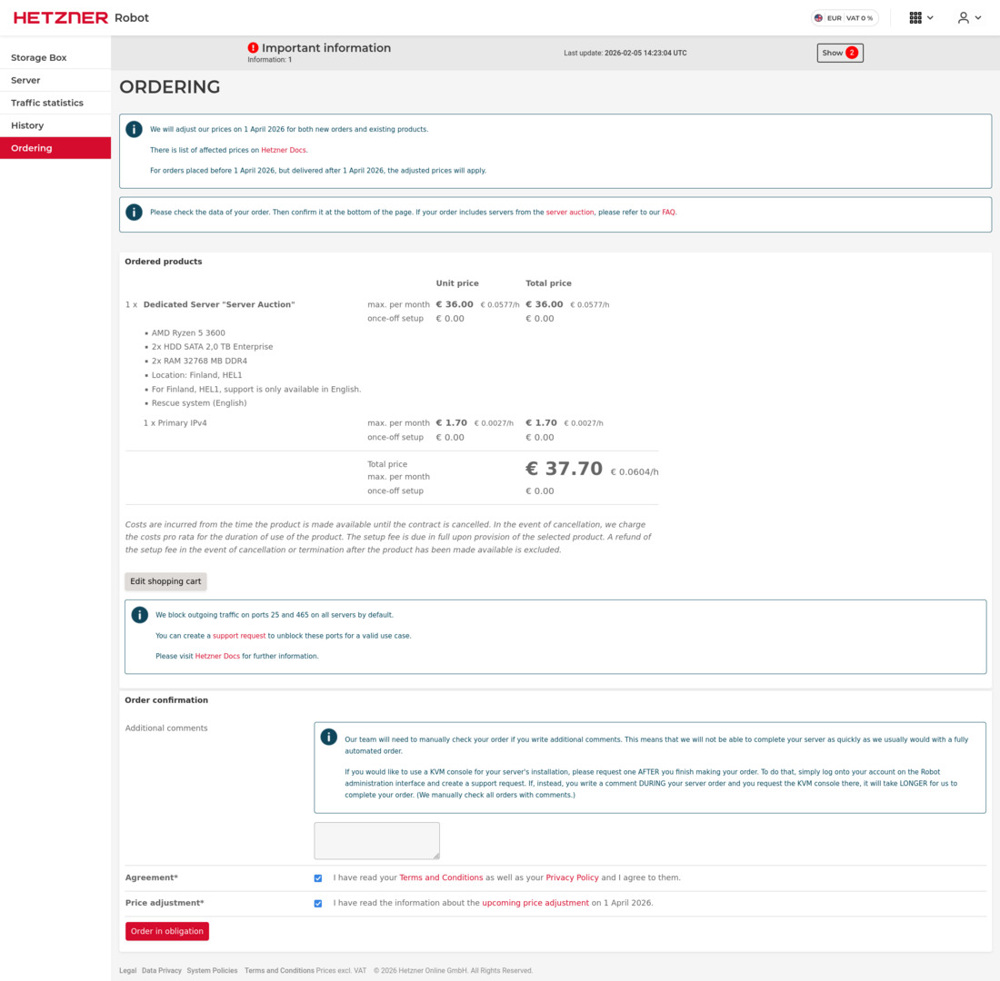

Once provisioned, make sure you have access to the server's rescue environment as that will be used to install IncusOS.

## Request KVM access

To configure the system firmware with UEFI Secure Boot and enabling the TPM, you'll need to request access to a KVM device.

This can be done for free through the support page and will provide you with access from 1 to 3 hours.
The procedure only takes a few minutes and KVM access won't be needed afterwards.

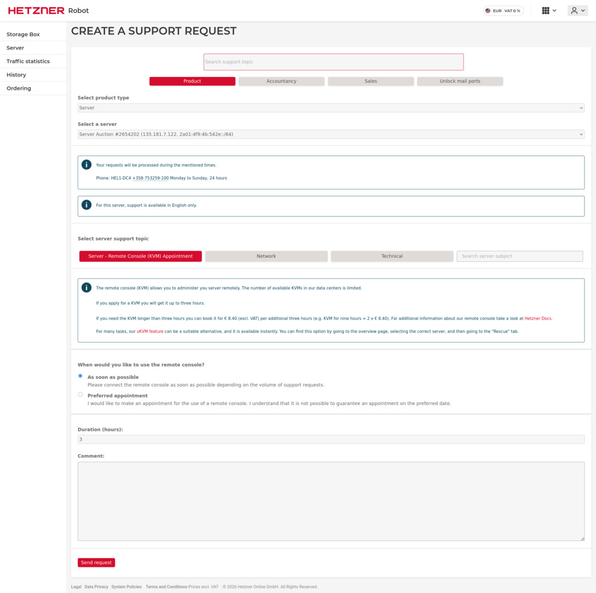

## Get a suitable IncusOS image

Follow the instructions to [get an IncusOS image](../download.md). For this installation, a USB operation mode image is required.

You'll also need to provide the network configuration for your server.
You can get the relevant values either from the Hetzner portal or by
querying them from the rescue environment with `ip link`, `ip -4 a` and
`ip -4 r` (add `ip -6 a` and `ip -6 r` if setting up IPv6 too).

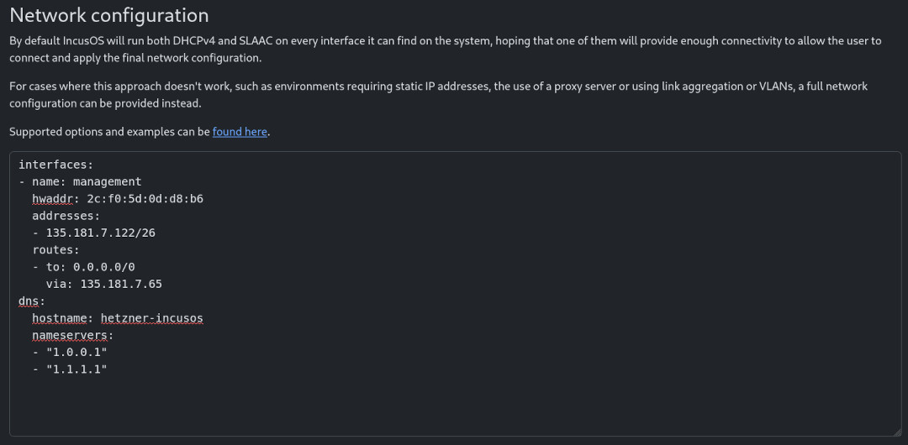

## Write the image to disk

Once downloaded, transfer the image over to the server using `scp` and then write it to disk.

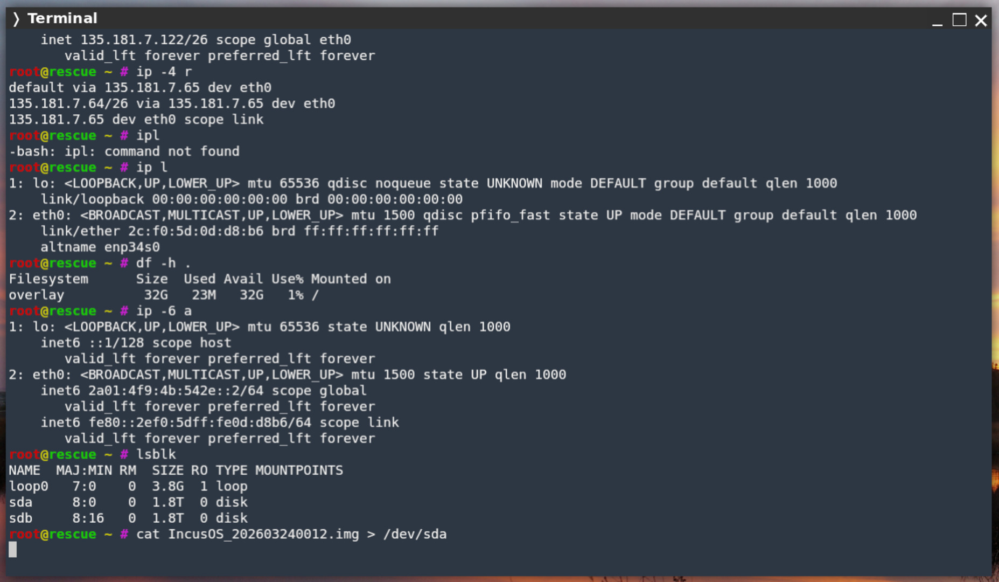

## Configure the firmware

At this point, the installation is done but the system won't be able to boot it.

Now you need to use that KVM you requested earlier to reboot the server and go in the firmware menu (by pressing `DEL` or `F2`).

The following steps may vary based on the exact platform but the general steps are:

- Enable UEFI booting
- Enable Secure Boot
- Set Secure Boot in custom mode
- Wipe the KEK database and load the IncusOS KEK
- Wipe the DB database and load the IncusOS DB keys (if system fails to boot, only append the keys)
- Enable the TPM device
- Save and reboot

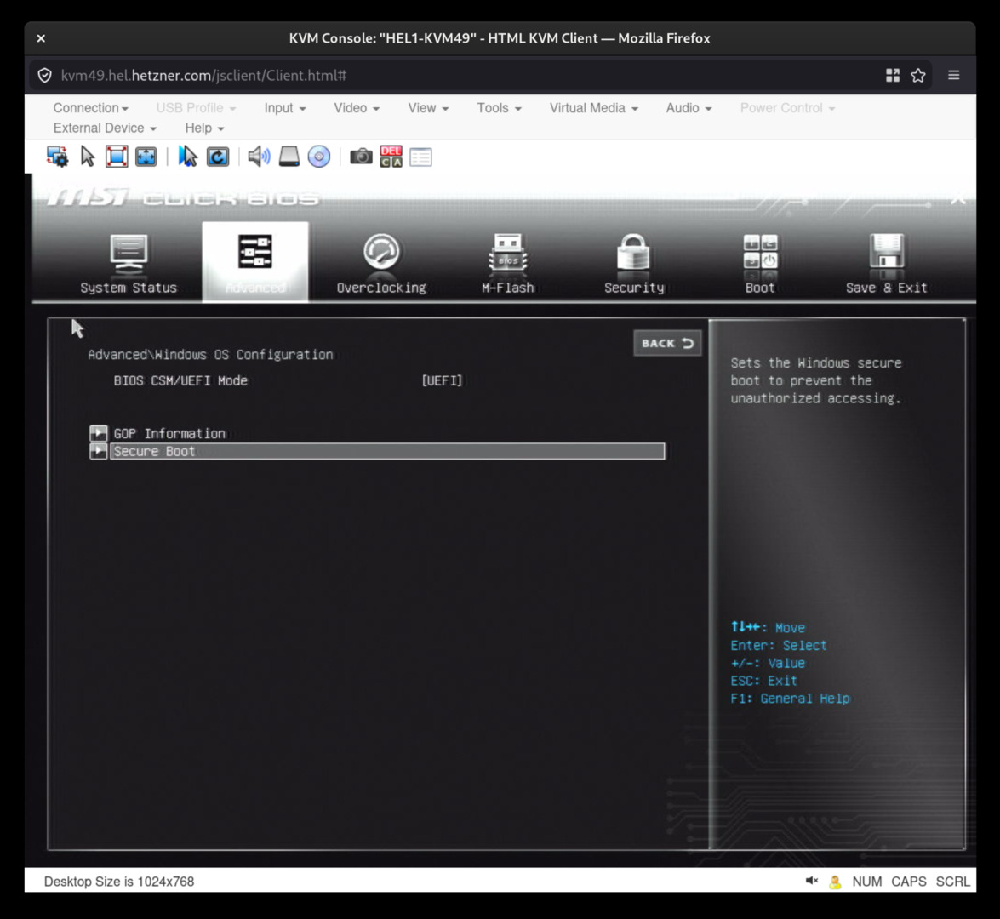
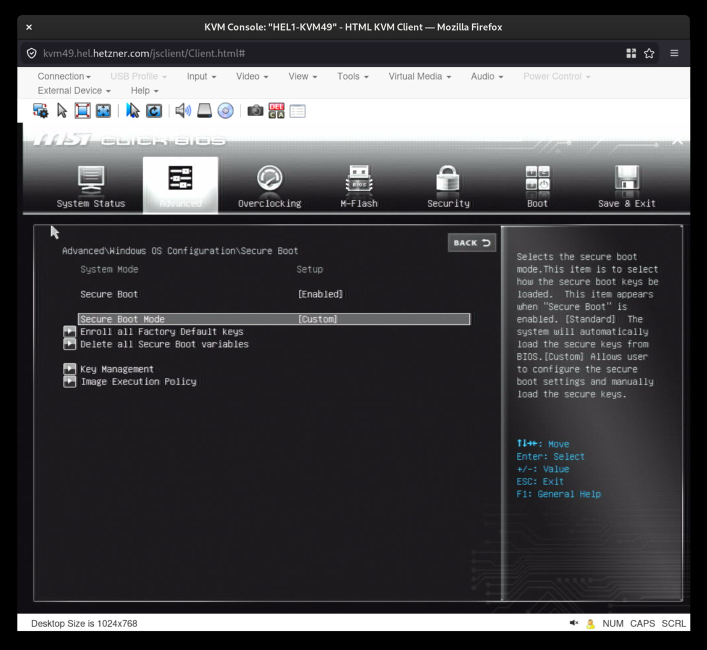
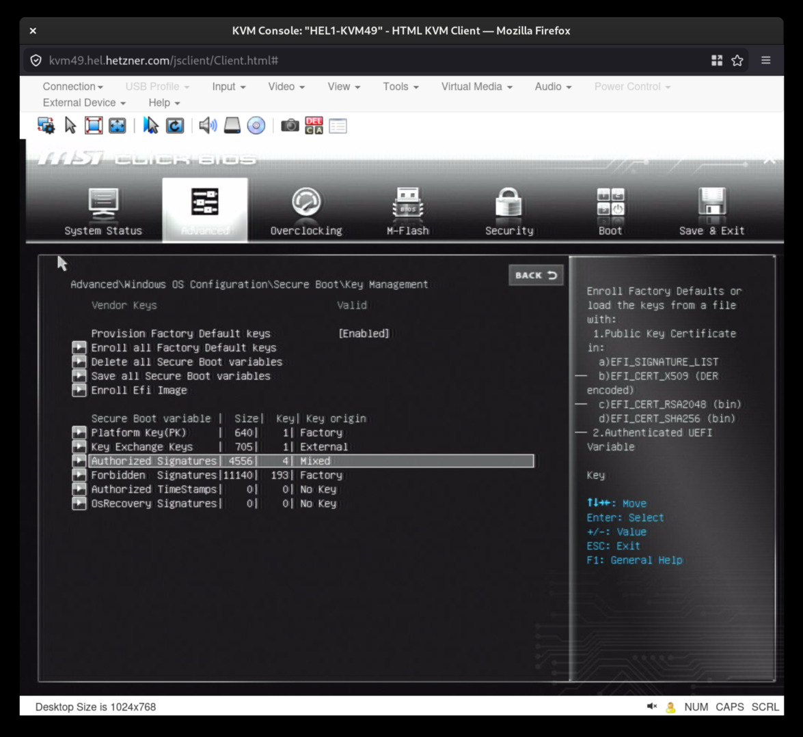
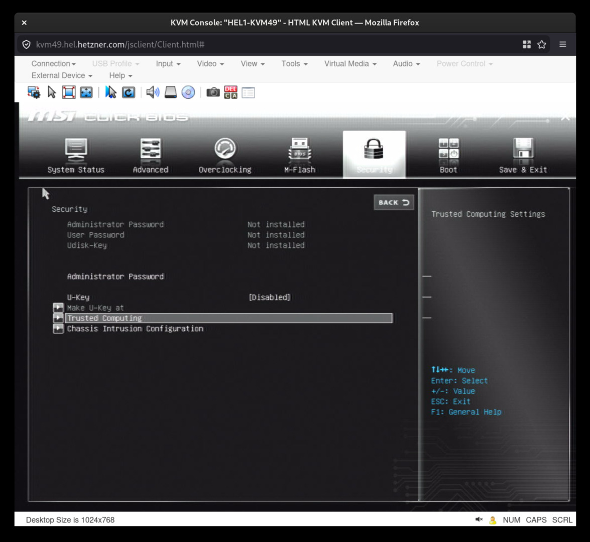
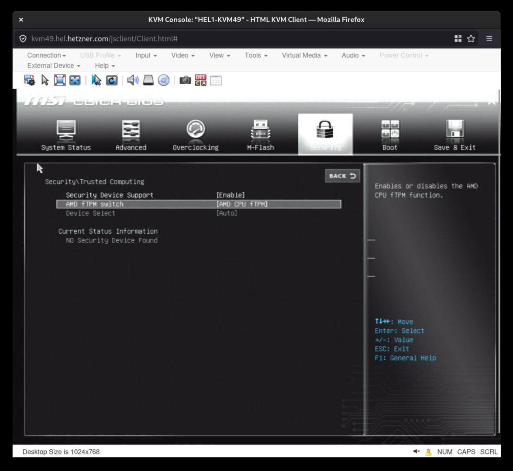

## IncusOS is ready for use

The system will now boot into IncusOS.

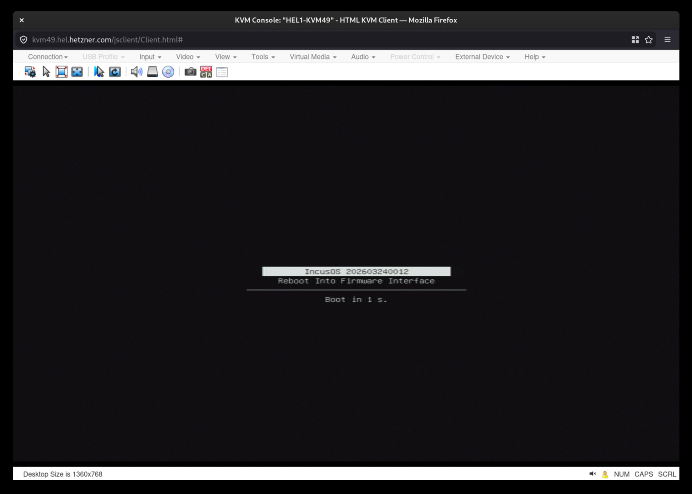

And after a little while, it will show the fully booted IncusOS.

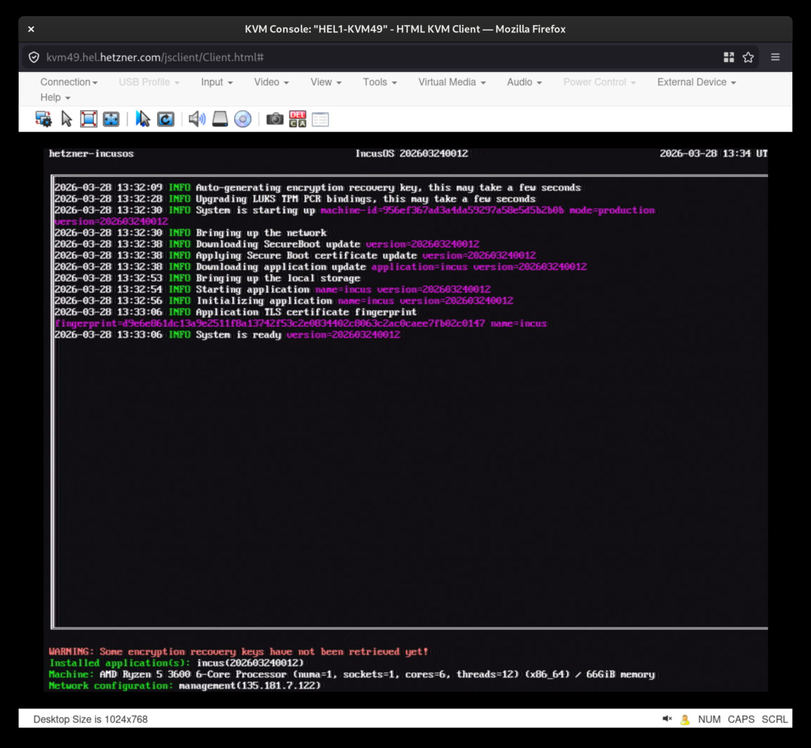

Once complete, follow the instructions for [accessing the system](../access.md).
