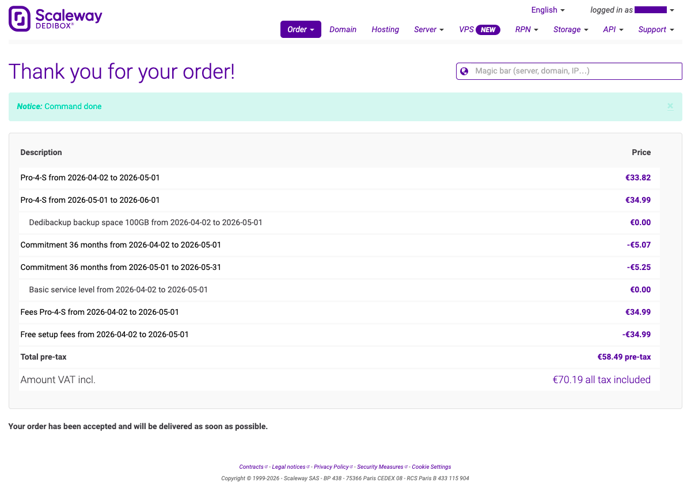
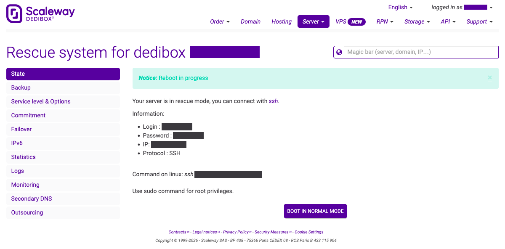
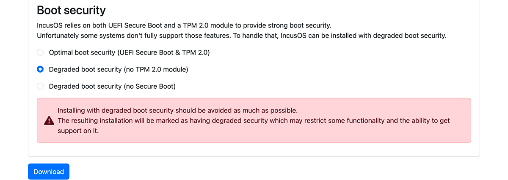
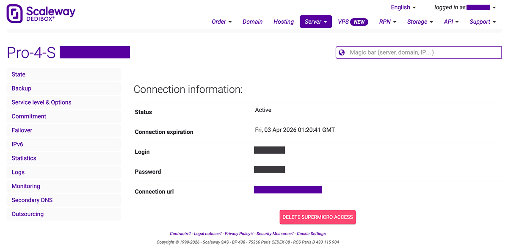
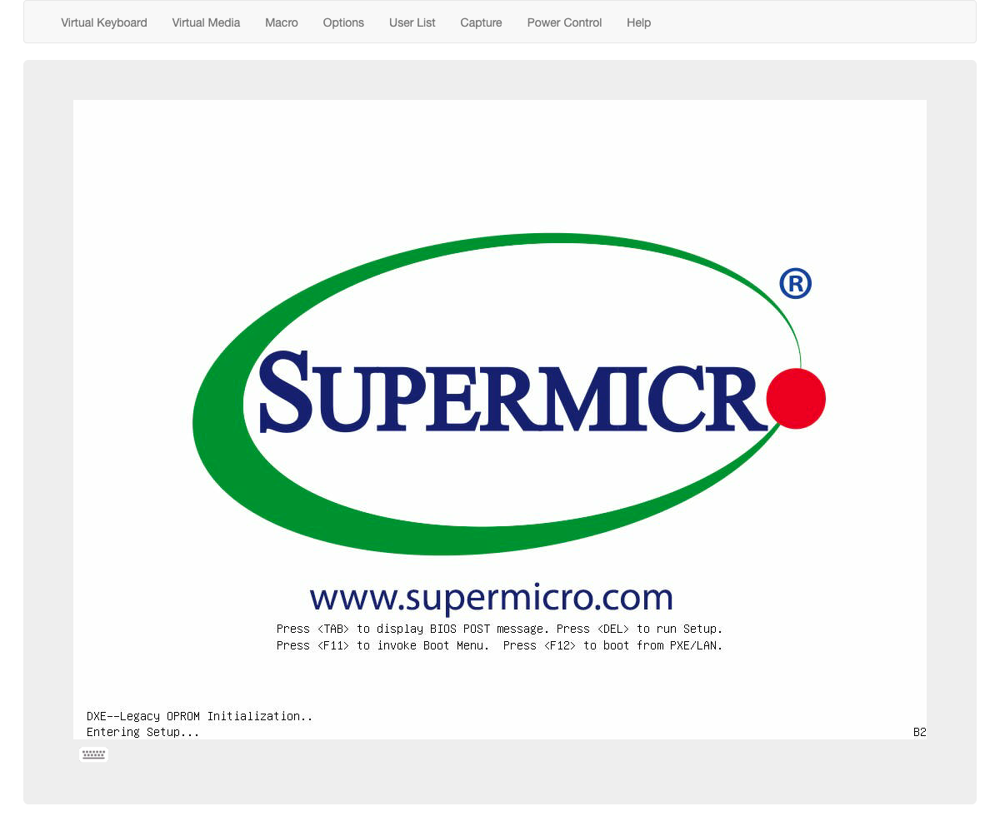
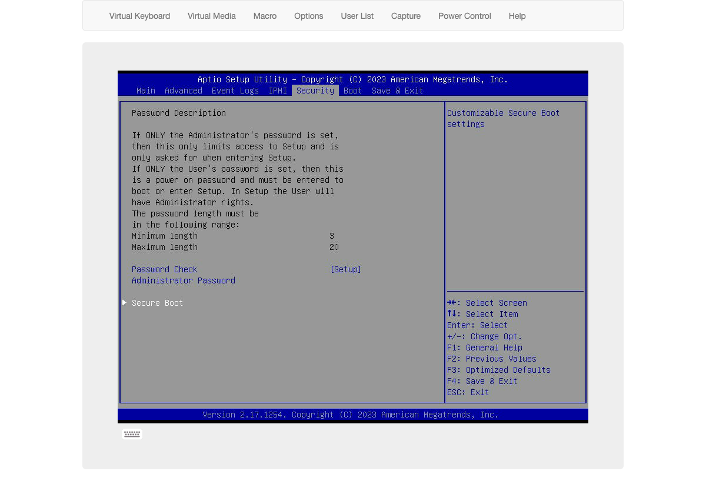
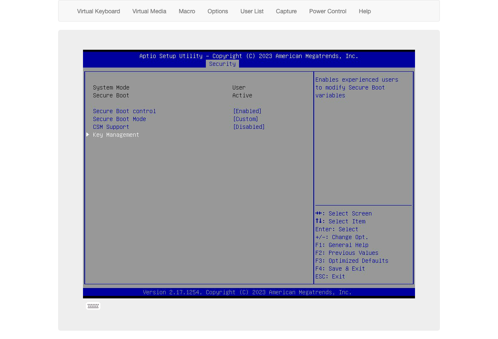
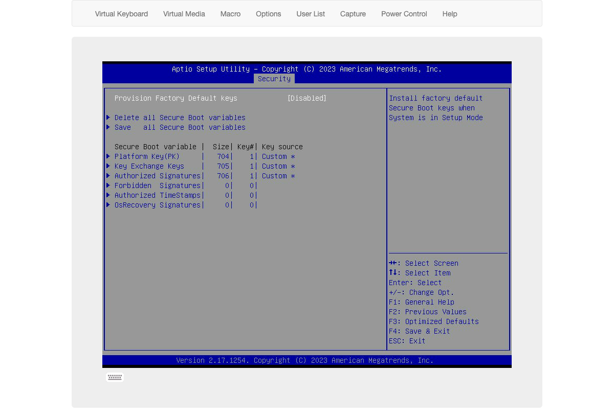
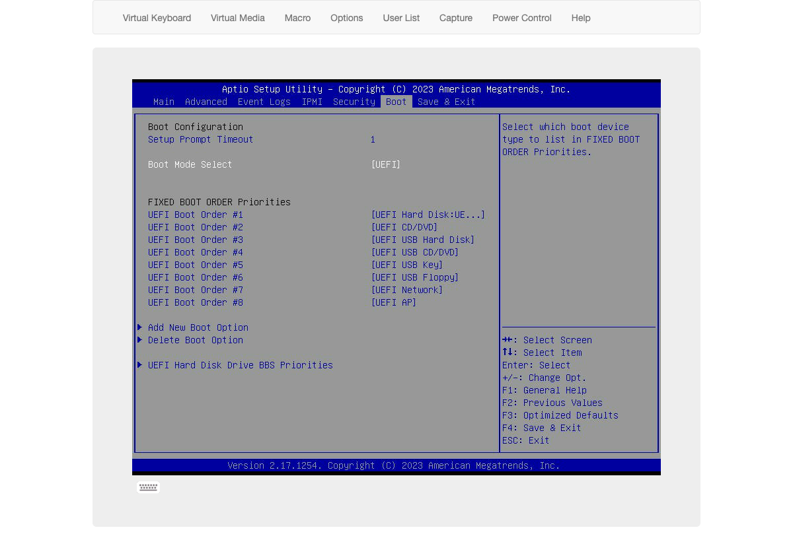
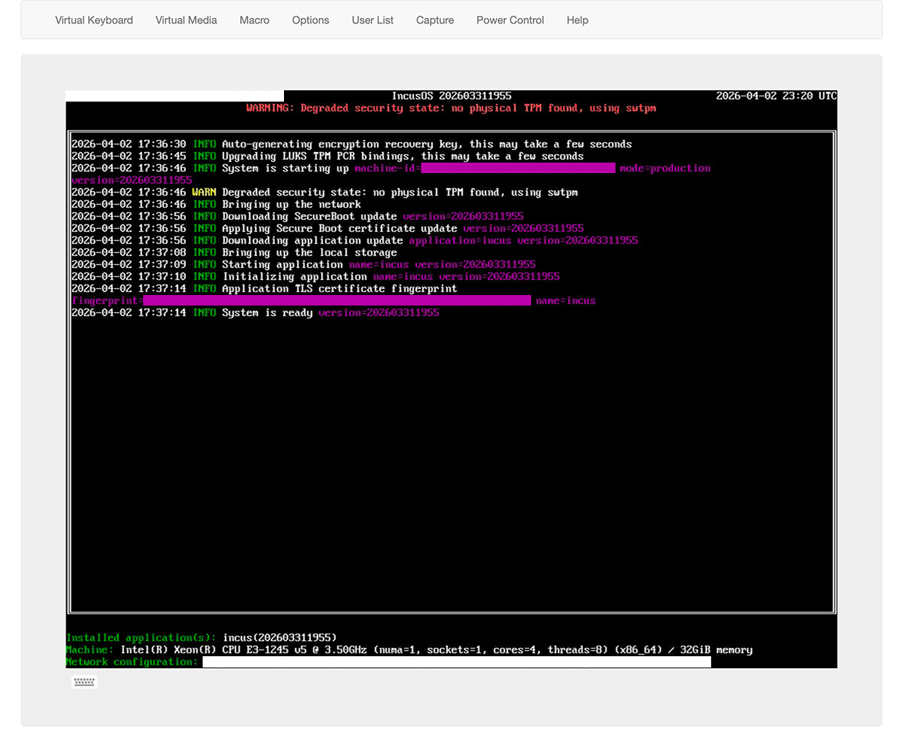

# Installing on a Scaleway dedicated server (Dedibox)

Dedibox servers do not typically come with a TPM installed, so you will need to use an IncusOS
image with degraded boot security.

## Order a server

Find the server that fits your needs on the
[server offers page](https://console.online.net/en/order/server).

For the purpose of this guide, an entry-level enterprise server, the Pro-4-S, equipped with an
Intel Xeon E3 1245v5, was used.



## Boot the server in rescue mode

In order to write the IncusOS image onto your server, you first need to click on “INSTALL OVER KVM”
in its management interface. After going back to the main page, a button allowing you to boot the
server in rescue mode will have appeared; click it. You will get SSH credentials to perform
operations after choosing the recovery image you want to boot.

```{note}
Even though the checkbox reading “I accept that Scaleway support team can connect to my server as
long as it is in rescue mode.” is highlighted, you are **not** required to check it. So, don’t.
```



Remember at the end of this guide to disable the rescue mode.

## Get a suitable IncusOS image

Follow the instructions to [get an IncusOS image](../download.md). For this installation, a USB operation mode image is required.

You don’t need to configure anything specific other than the “Boot security” option, which must be
set to “Degraded boot security (no TPM 2.0 module)”.



## Write the image to disk

Once downloaded, transfer the image over to the server using `scp` and then write it to disk, for
example with:

```
cat IncusOS_202603311955.img > /dev/sda
```

## Configure the firmware

At this point, the installation is done but the system won’t be able to boot it.

Click “KVM OVER IP” in the server management interface, read carefully and understand the scary
warning message, enter your computer’s public IP address to allow access to the KVM interface, then
login to your board’s remote management interface.



Remember at the end of this guide to revoke the KVM access.

If you end up on a SuperMicro interface, spawn an HTML5 console in Remote Control > iKVM/HTML5,
reboot the server, and access the firmware menu, typically by pressing `DEL`, when prompted. Other
manufacturers have different but similar interfaces.



The following steps are roughly:

- Enable UEFI booting
- Enable Secure Boot
- Set Secure Boot in custom mode
- Wipe Secure Boot databases
- Load the IncusOS PK, KEK and DB (called “Authorized Signatures” on SuperMicro) keys
- Save and reboot






Don’t forget to disable the recovery mode (which should now be broken anyway) and revoke your KVM
access. When you don’t need the server anymore, reset all BIOS options to return to a factory state
and avoid a surprise bill because manual intervention was needed.

## IncusOS is ready for use

The system will now boot into IncusOS.



Once complete, follow the instructions for [accessing the system](../access.md).
