# Installing on a physical machine

## Getting and preparing the install media

Follow the instructions to [get an IncusOS image](../download.md).

If installing the machine using a virtual CD-ROM drive, use the ISO format.
If installing using a USB stick or a virtual USB drive, use the USB format.

When using the USB image, make sure it's written directly to the device,
no changes should be made to the built-in partitions or data.

Once ready, connect the USB stick or attach the virtual media and reboot the server into its firmware menu (BIOS).

## Configuring the BIOS

Every vendor uses a different firmware configuration layout, but in general, these are the main things to configure:

- Disable any RAID mode configuration option (known to break IncusOS boot on some platforms)
- Enable the TPM 2.0 device (if not already enabled)
- Turn on and configure Secure Boot
   - Use the "custom" security policy
   - If available, ensure the system is in "user" mode
   - Load the IncusOS keys:
      - Wipe everything from KEK and load the IncusOS KEK key
      - Wipe as much as possible from DB and load the IncusOS DB key(s)
- Change the boot order to boot from the install media

```{note}
Some servers require specific Secure Boot keys be loaded in order to allow booting from NVME or storage controllers.
Those most often rely on the Microsoft UEFI CA key and so may require that key be kept in DB.
```

An alternative to manually loading the IncusOS Secure Boot keys is to use the "setup" mode.
This effectively clears all the keys and lets IncusOS provision Secure Boot on first boot.
While convenient, this offers less control on the exact set of keys being allowed and can interfere with add-in cards.

````{tabs}
```{group-tab} Generic

Secure Boot is the trickiest one of those and exact options vary between vendors.

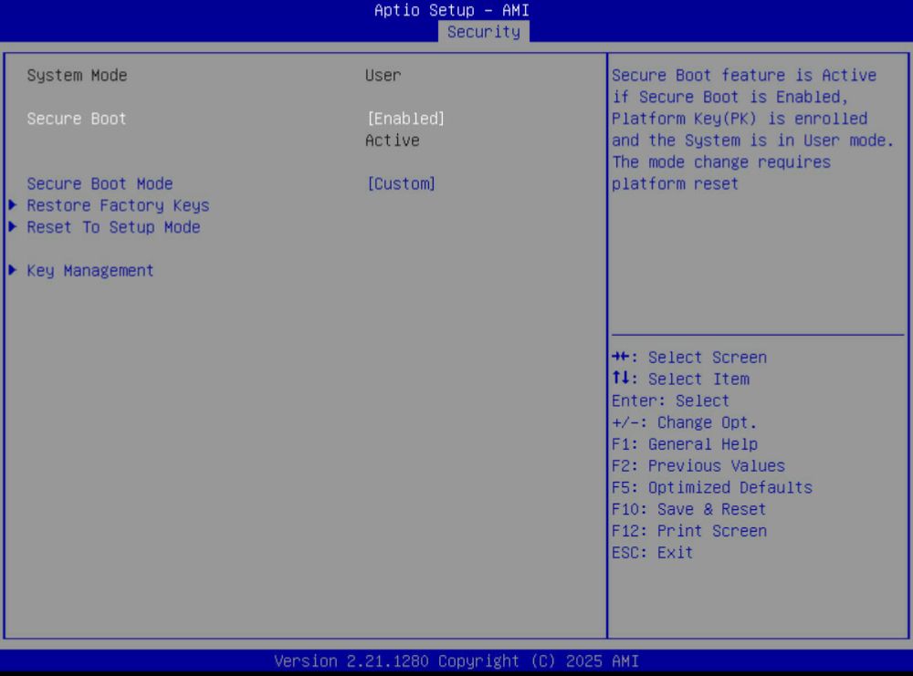

There are two main options when it comes to Secure Boot:

- Manually clear some of the existing keys and enroll the IncusOS ones
- Clear everything and put the system in Setup Mode

Secure Boot Setup Mode is the easiest as it's often just one option to
select and the system will then boot with an empty Secure Boot state,
allowing the IncusOS install media to enroll the keys directly.

The downside to this approach is that all preexisting keys get removed.
This is fine in most situations, but in some scenarios you may have
hardware which requires firmware components to be loaded during boot,
this includes some network cards and storage controllers.

In those scenarios, you'll want to instead manually enroll the IncusOS
KEK and DB keys, assuming your firmware provides an option for this.

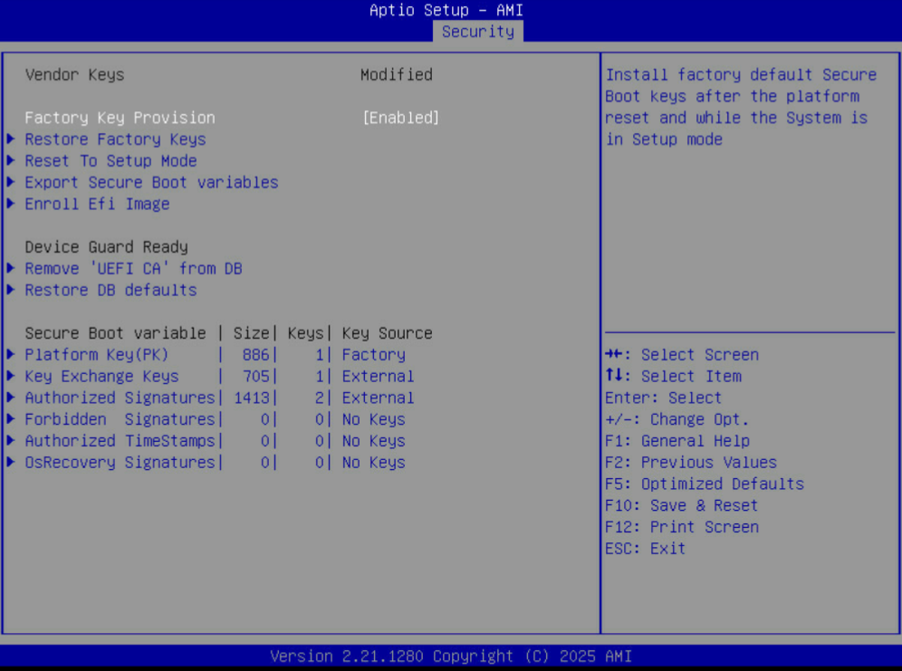
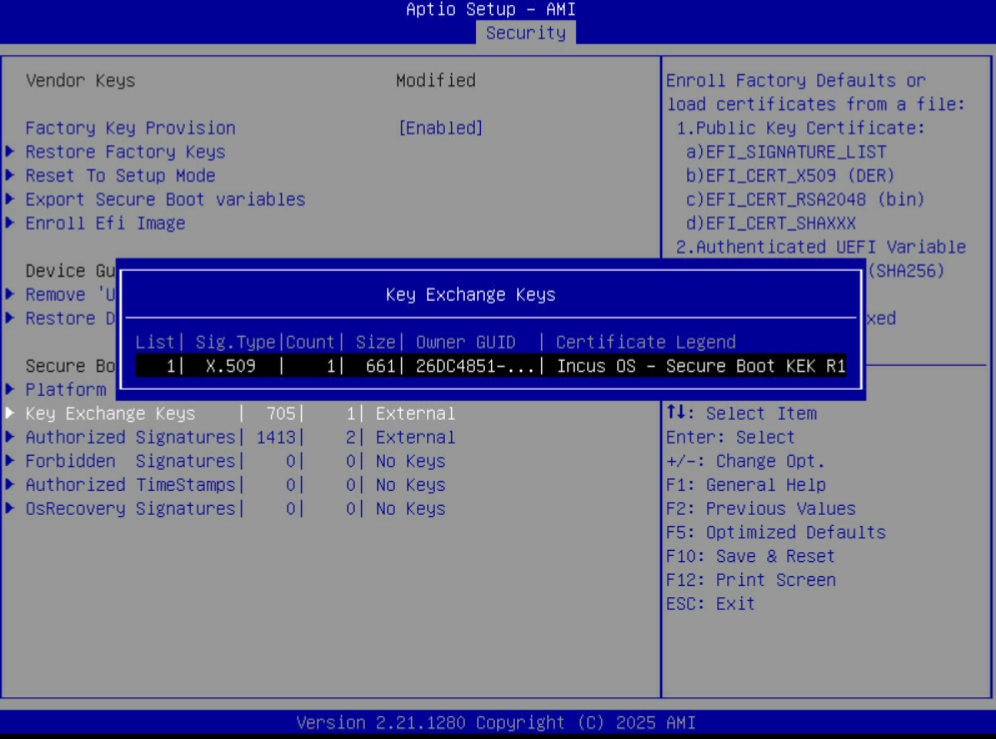
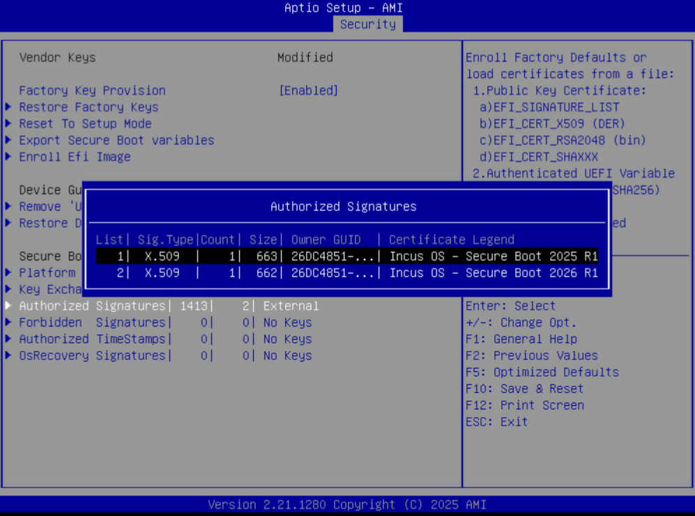

The install media contains a `keys` folder which has the `.der` version
of all three keys that need to be enrolled. Exact mechanism for manual
enrollment varies widely between vendors.

Once the Secure Boot configuration is complete, go to the boot order
page and make sure that the system will boot from the install media,
then finally save all settings and reboot the system.
```

```{group-tab} Asus
Asus servers use an AMI Aptio based firmware with a standard layout.

Those servers don't require additional Secure Boot keys be loaded to
handle regular boot operations, as a result, all DB keys can be safely wiped.


```

```{group-tab} Cisco
Cisco UCS servers don't offer full Secure Boot configuration.
Instead they only come with a limited number of ready made Secure Boot
configurations and are therefore incompatible with IncusOS.

To install IncusOS on those servers, you will need to keep Secure Boot
disabled and instead rely on an IncusOS image configured with TPM-only
boot security.
```

```{group-tab} DELL
DELL servers provide a full Secure Boot configuration.

The NVME and storage controllers in those servers often rely on the
Microsoft UEFI CA in order to boot, as a result those keys should be
retained in DB.

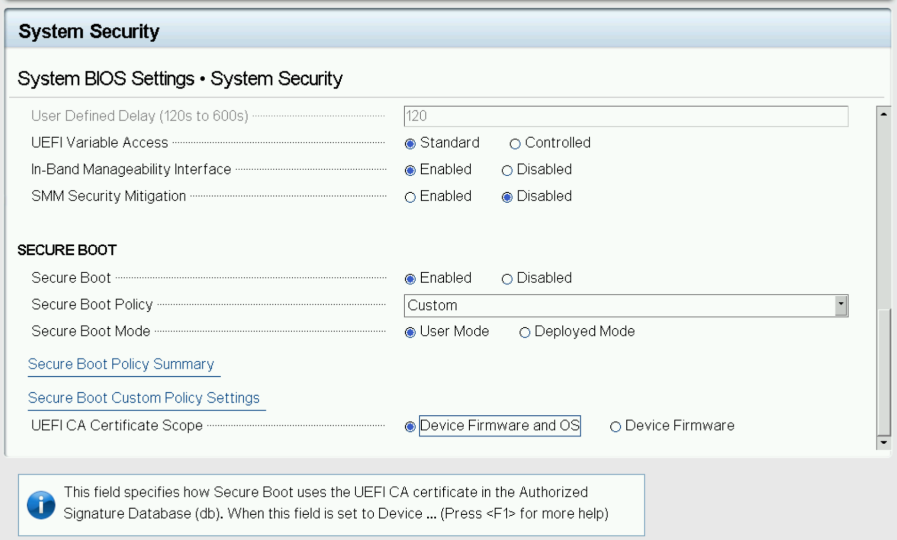
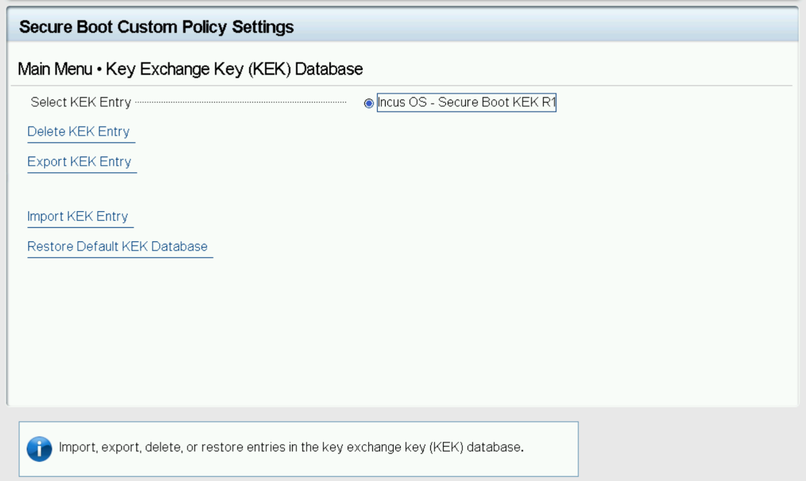
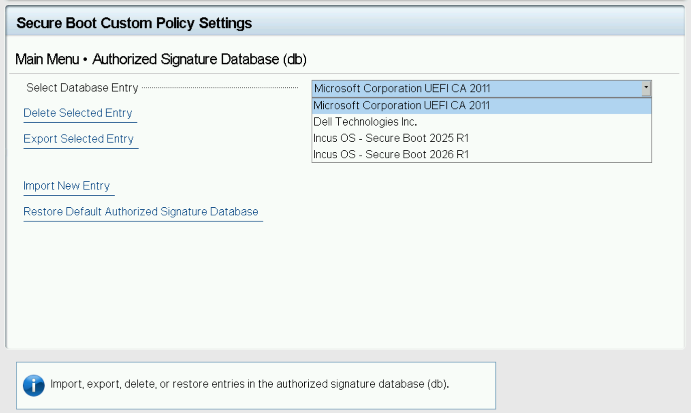
```

```{group-tab} HP
HP servers don't offer much visibility on the exact Secure Boot policy in place.

They do still allow clearing all keys and loading custom ones and those
servers don't appear to typically rely on additional Secure Boot keys in
order to boot.

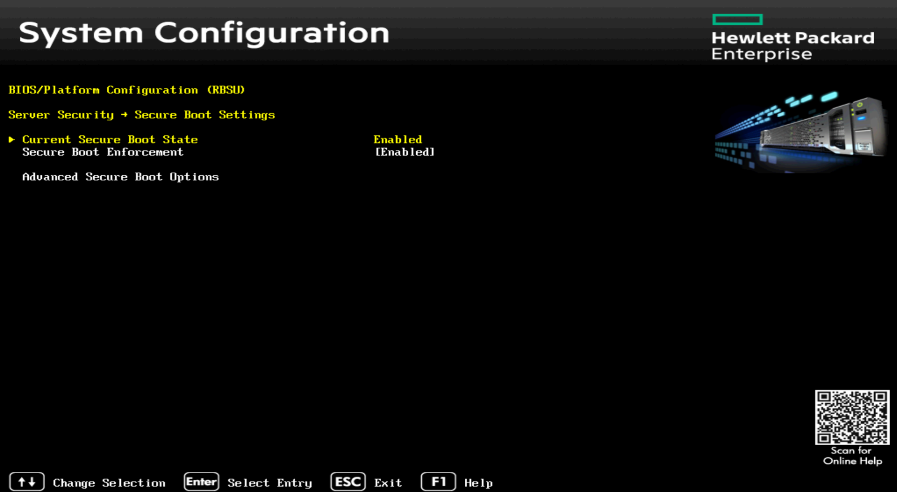
```

```{group-tab} Lenovo
Lenovo servers use a modified version of AMI Aptio for their firmware.

The Lenovo issued DB keys are known to contain some invalid fields that
can cause boot issues on some systems. The Microsoft UEFI CA keys are
often required to get NVME boot working correctly.

Additionally, we've observed a number of systems running into issues due
to preexisting TPM state on those systems. A TPM clear is recommended
prior to installation.

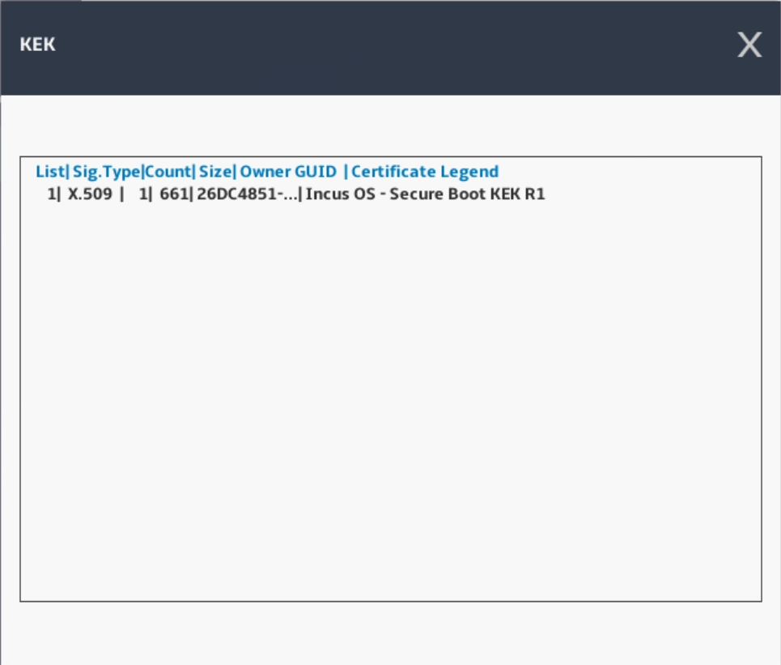
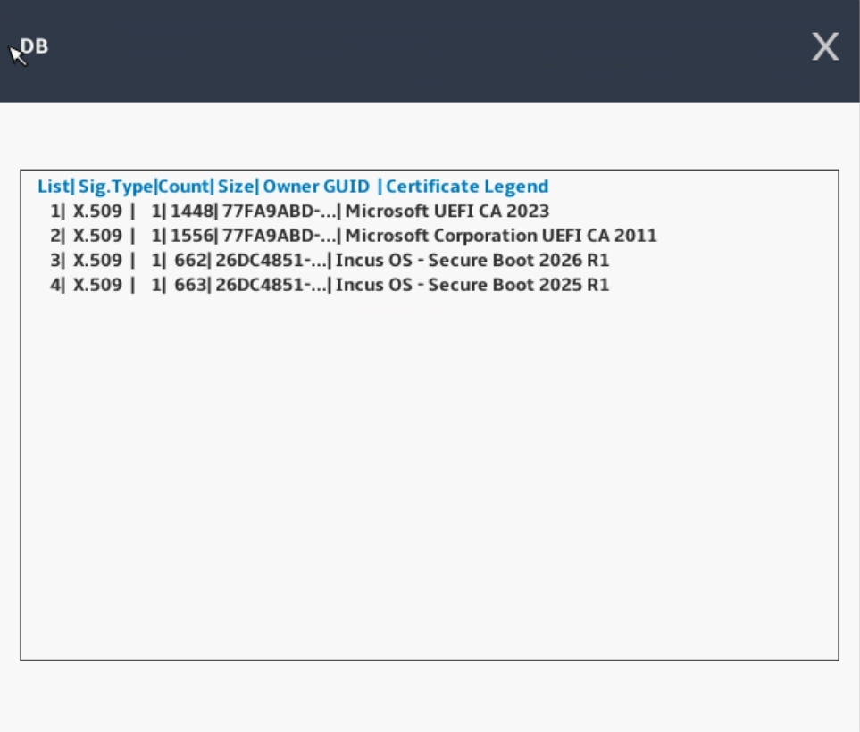
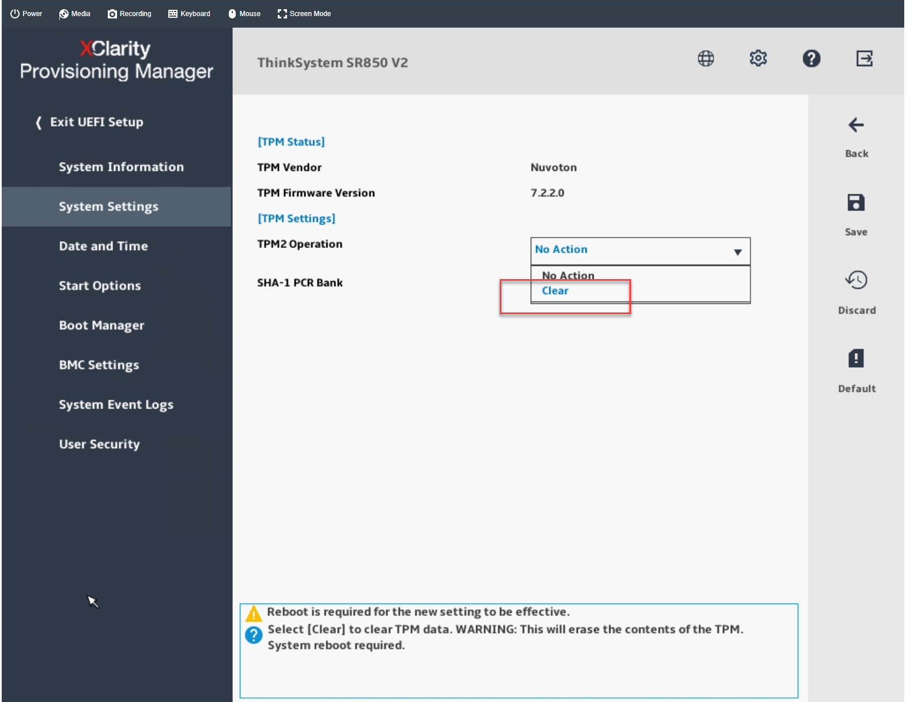
```

```{group-tab} SuperMicro
SuperMicro servers use an AMI Aptio based firmware with a standard layout.

Those servers don't require additional Secure Boot keys be loaded to
handle regular boot operations, as a result, all DB keys can be safely wiped.

As most servers default to having CSM (legacy BIOS) enabled by default,
it's important to start by making sure that all add-in cards run in UEFI
mode, then attempt to boot with CSM disabled. Only once that works
reliably, should Secure Boot get configured.


```

````

## IncusOS installation

Depending on Secure Boot settings, the system will now either directly
boot into the installer, or it will first handle key import, then reboot
and boot into the installer.

When handling key import (when using Setup Mode), a countdown will show
up, at the end of which the system will import the keys and reboot.

At the end of the installation, you will be prompted to disconnect the
install media, the system will then reboot into the installed IncusOS
system.

## IncusOS is ready for use

After reboot, IncusOS will perform its first boot configuration. Once complete, follow the instructions for [accessing the system](../access.md).


