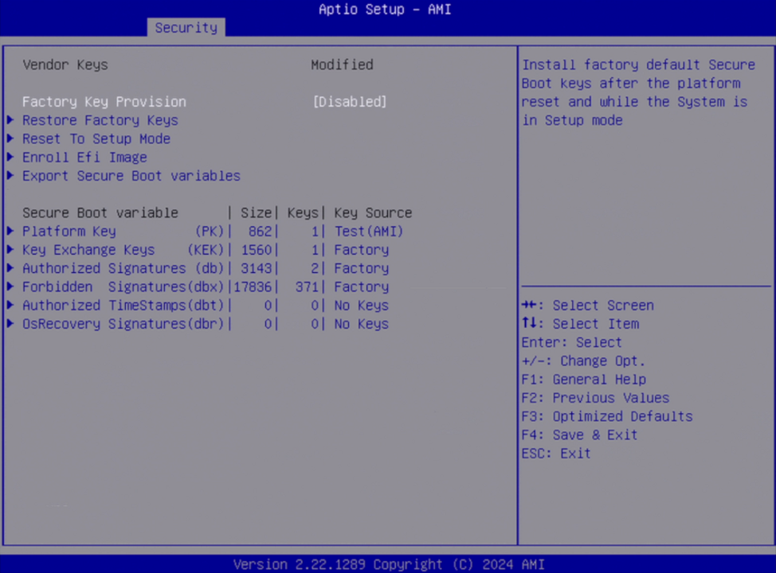
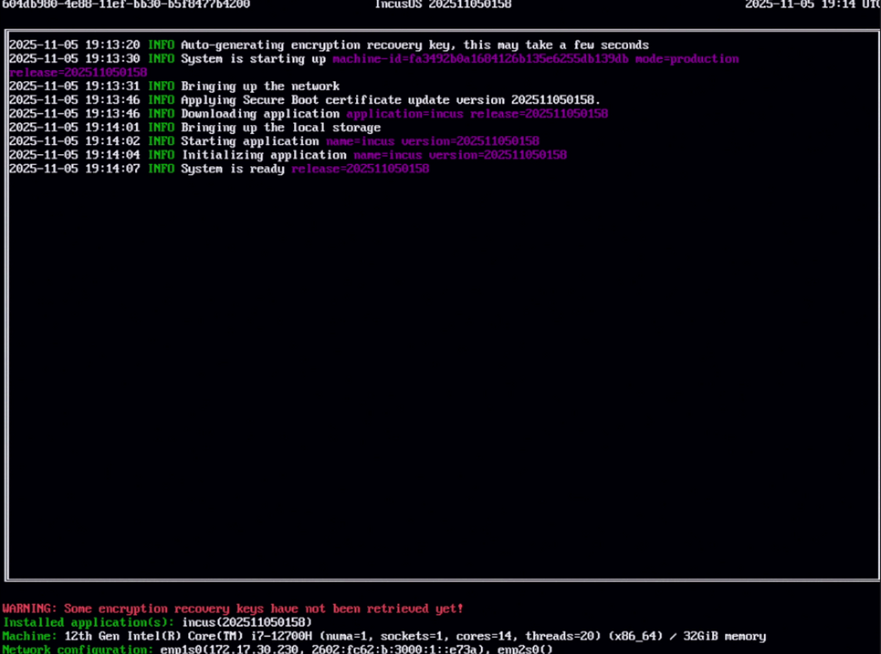

# Installing on a physical machine

## Getting and preparing the install media

Follow the instructions to [get an IncusOS image](../download.md).

If installing the machine using a virtual CD-ROM drive, use the ISO format.
If installing using a USB stick or a virtual USB drive, use the raw image format.

When using the raw image, make sure it's written directly to the device,
no changes should be made to the built-in partitions or data.

Once ready, connect the USB stick or attach the virtual media and reboot the server into its firmware menu (BIOS).

## Configuring the BIOS

Every vendor uses a different firmware configuration layout, but in general, there are three things to configure:

- Enable the TPM 2.0 device (if not already enabled)
- Turn on and configure Secure Boot
- Change the boot order to boot from the install media

Secure Boot is the trickiest one of those and exact options vary between vendors.

There are two main options when it comes to Secure Boot:

- Manually clear some of the existing keys and enroll the IncusOS ones
- Clear everything and put the system in Setup Mode

Secure Boot Setup Mode is the easiest as it's often just one option to
select and the system will then boot with an empty Secure Boot state,
allowing the IncusOS install media to enroll the keys directly.

The downside to this approach is that all preexisting keys get removed.
This is fine in most situations, but in some scenarios you may have
hardware which requires firmware components to be loaded during boot,
this includes some network cards and storage controllers.

In those scenarios, you'll want to instead manually enroll the IncusOS
KEK and DB keys, assuming your firmware provides an option for this.

The install media contains a `keys` folder which has the `.der` version
of all three keys that need to be enrolled. Exact mechanism for manual
enrollment varies widely between vendors.

Once the Secure Boot configuration is complete, go to the boot order
page and make sure that the system will boot from the install media,
then finally save all settings and reboot the system.

## IncusOS installation

Depending on Secure Boot settings, the system will now either directly
boot into the installer, or it will first handle key import, then reboot
and boot into the installer.

When handling key import (when using Setup Mode), a countdown will show
up, at the end of which the system will import the keys and reboot.

At the end of the installation, you will be prompted to disconnect the
install media, the system will then reboot into the installed IncusOS
system.

## IncusOS is ready for use

After reboot, IncusOS will perform its first boot configuration. Once complete, follow the instructions for [accessing the system](../access.md).

