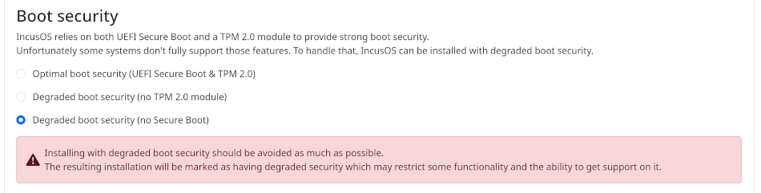
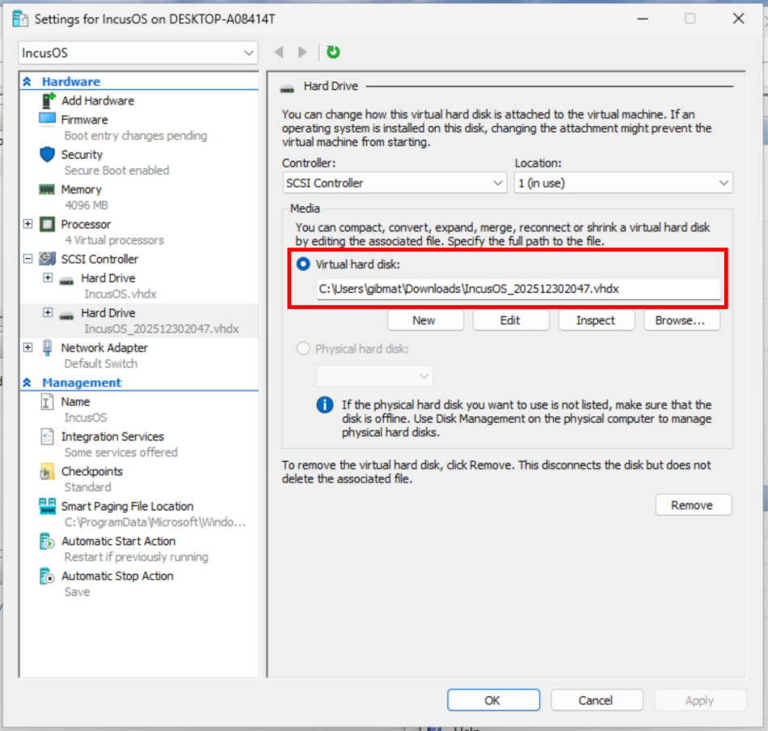
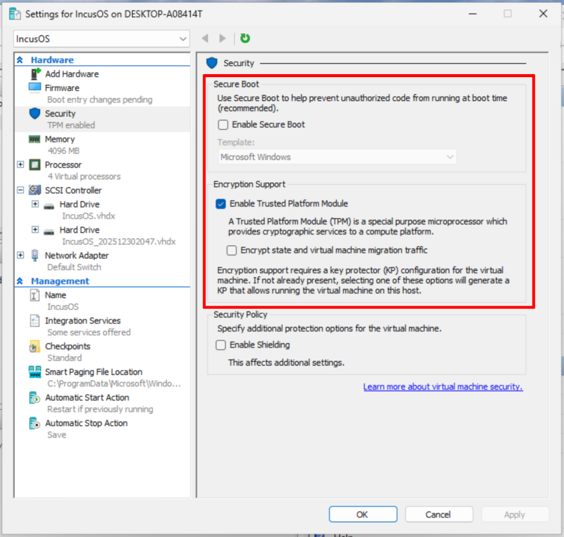
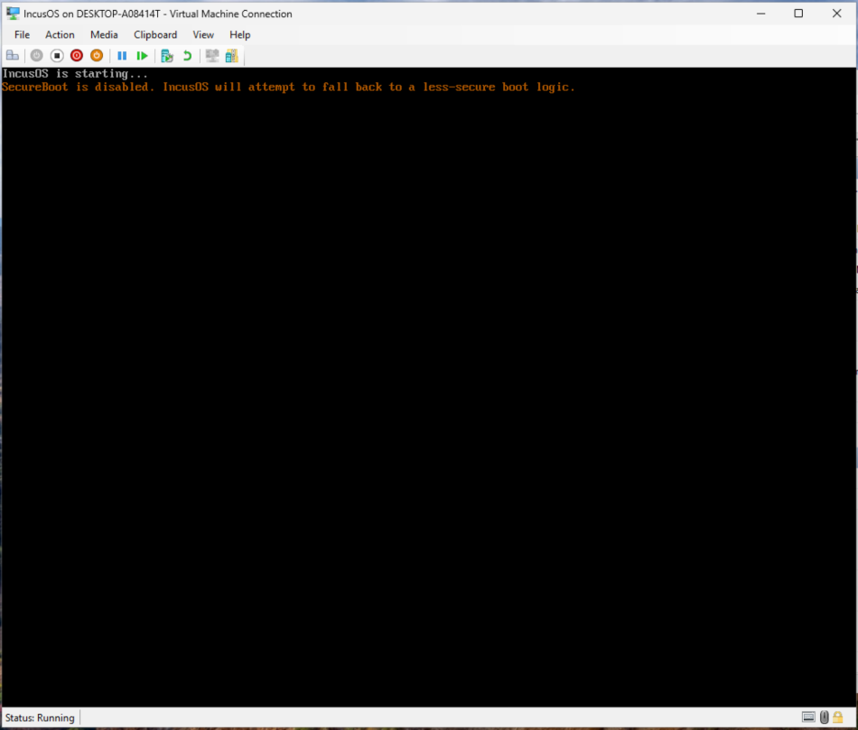
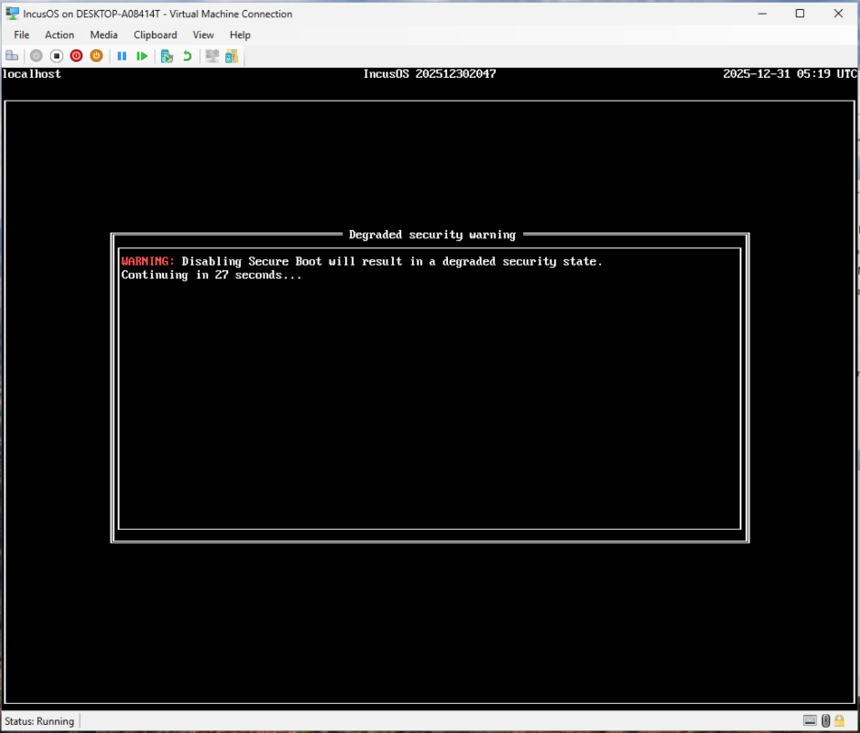
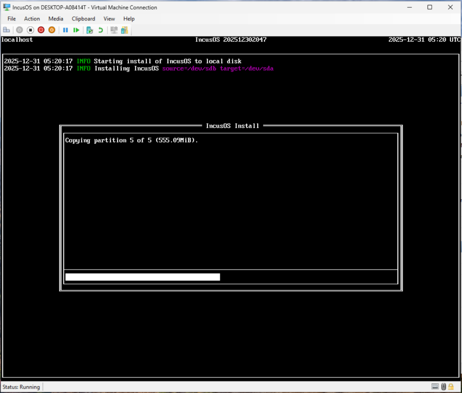
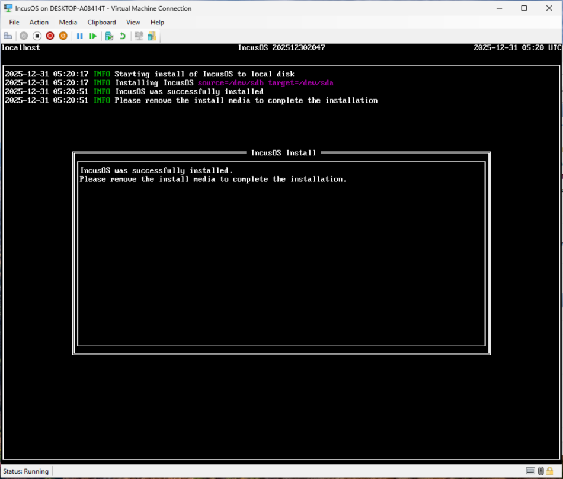

# Installing in a Microsoft Hyper-V virtual machine

IncusOS can be installed in a Microsoft Hyper-V virtual machine. Of all the supported virtualization platforms, Hyper-V is by far the most difficult to properly configure. As such, running IncusOS on Hyper-V is considered an advanced use case.

```{warning}
Microsoft Hyper-V does not support enrolling custom Secure Boot keys. This requires [disabling Secure Boot](../../reference/installing-without-secureboot.md), which will result in a degraded security state. Only proceed if you fully understand the implications.
```

## Get install media

Follow the instructions to [get an IncusOS image](../download.md). Hyper-V requires using a USB (IMG) install image. A CD-ROM (ISO) image will _not_ work.

The install seed must include `security.missing_secure_boot = true`. If using the web-based customizer UI, you can set this option under the "Advanced settings" section.



## Convert the install media

Hyper-V doesn't support raw disk images, so after downloading the USB install media we must convert the install image into a format it understands:

```
qemu-img convert IncusOS_202512302047.img -O vhdx -o subformat=dynamic IncusOS_202512302047.vhdx
```

## Create a new virtual machine

Create a new virtual machine and when asked to make an installation option, select "Install an operating system later".


Once the virtual machine is created, open its settings and add the `.vhdx` image as a second virtual hard disk.



### Secure Boot and TPM configuration

IncusOS depends on a v2.0 TPM; as mentioned above we must disable Secure Boot when running in a Hyper-V virtual machine. When configuring the virtual machine, make the following selections under "Security":

* Uncheck "Enable Secure Boot"

* Check "Enable Trusted Platform Module"



### CPU, memory, network, and local storage

Configure the CPU and memory for the virtual machine as desired and add at least one network interface.

Remember that the main system drive must be at least 50GiB or larger.

## IncusOS installation

Start the virtual machine; when IncusOS starts you will see a boot warning about Secure Boot being disabled.



Before the install commences, a warning message will be displayed for 30 seconds.



Finally, IncusOS will begin its installation.



Upon completion of the install, stop the virtual machine and remove the second hard disk.



## IncusOS is ready for use

Start the virtual machine, and IncusOS will perform its first boot configuration. Once complete, follow the instructions for [accessing the system](../access.md).

Because Secure Boot is disabled, a prominent header will display a warning about the degraded security state of the system.


