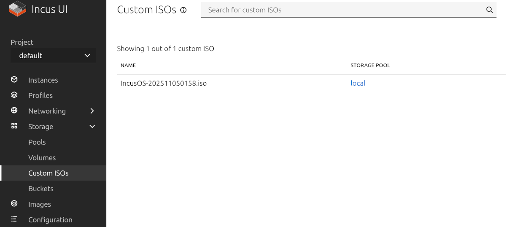
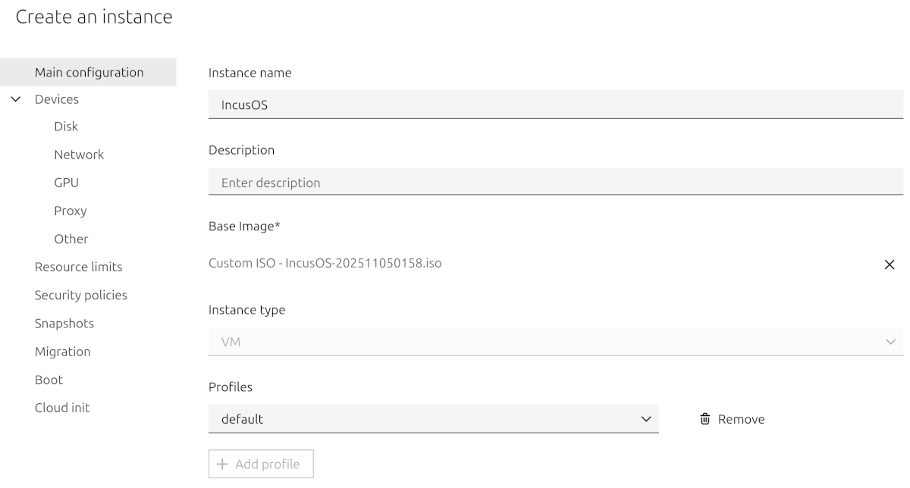
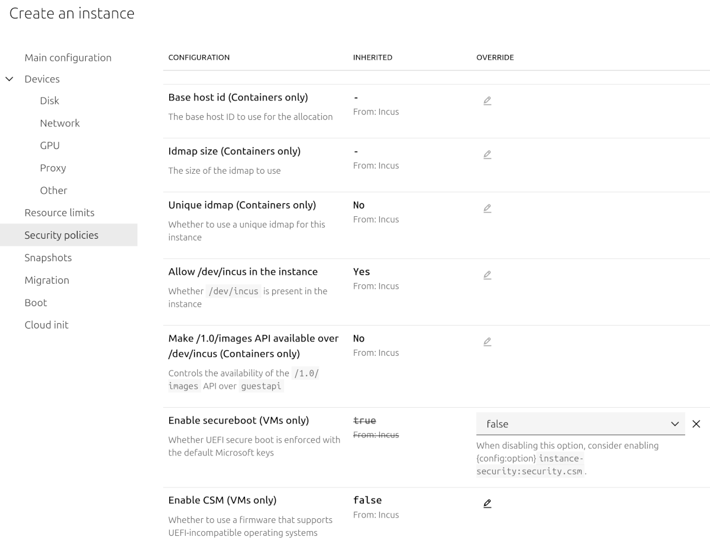
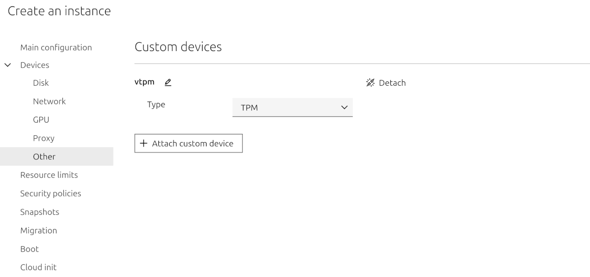
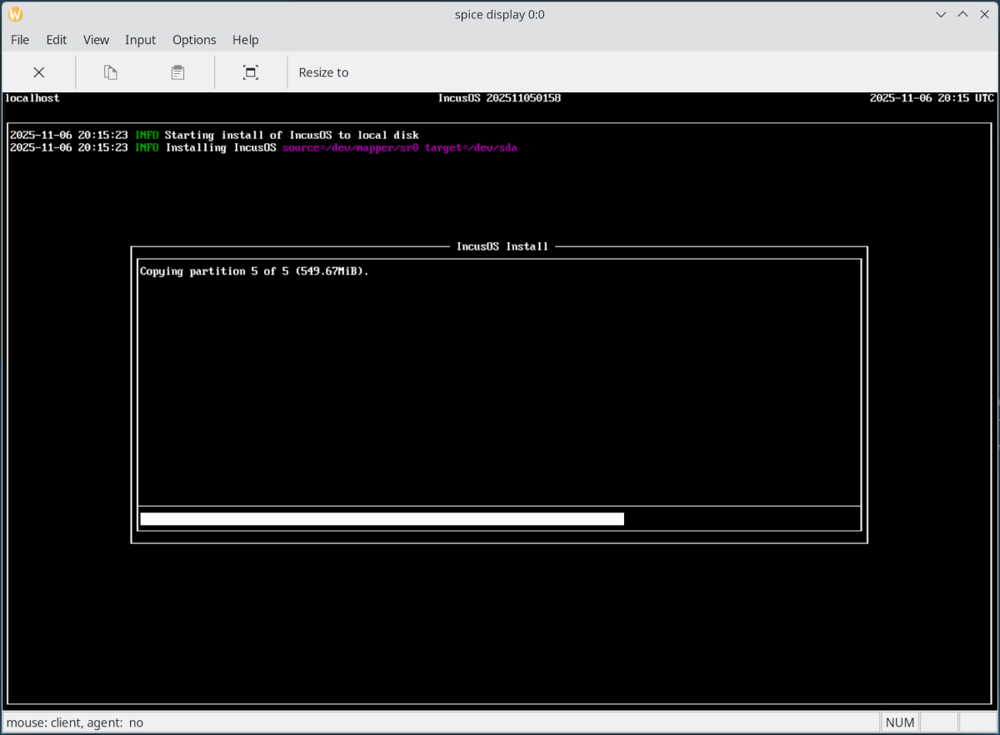
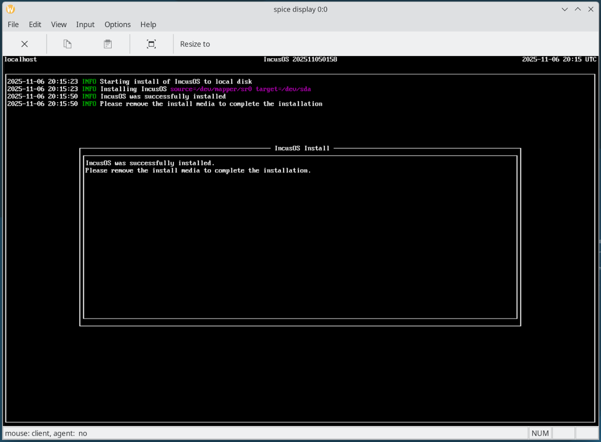
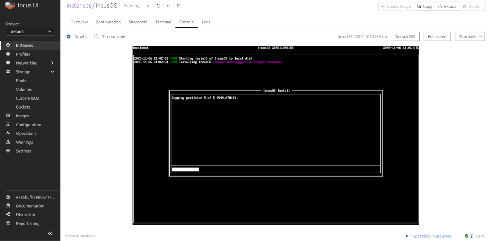
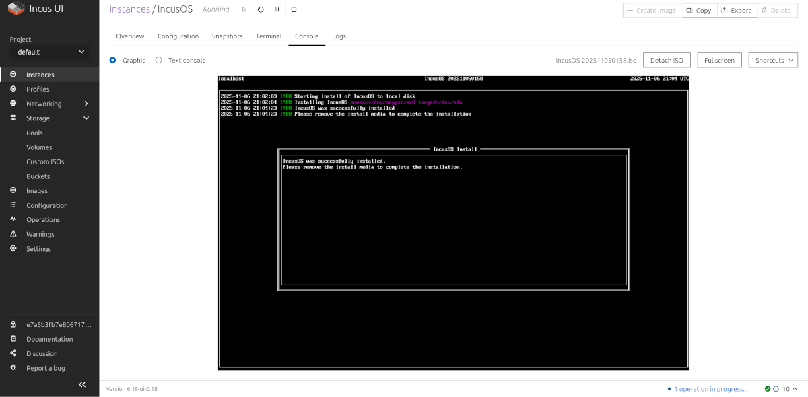
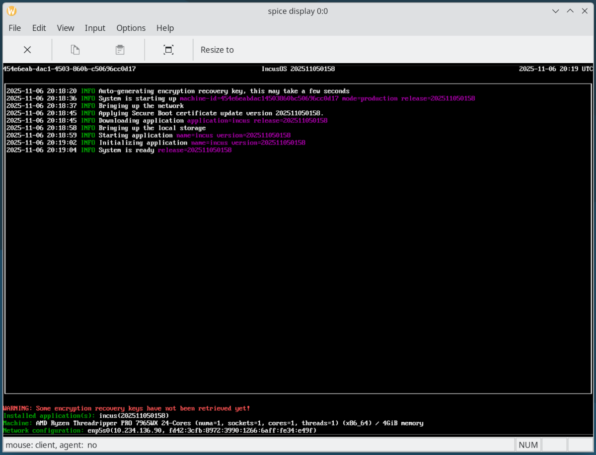
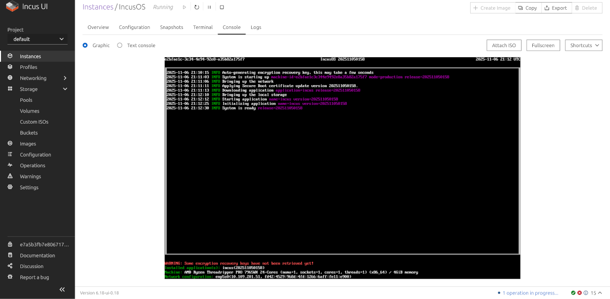

# Installing in an Incus virtual machine

IncusOS can be easily installed in an Incus virtual machine.

## Get and import install media

Follow the instructions to [get an IncusOS image](../download.md). This document will assume an ISO image is used.

Once downloaded, import the ISO image to Incus' storage.

````{tabs}

```{group-tab} Command line

    incus storage volume import default Downloads/IncusOS_202511050158.iso IncusOS_202511050158.iso --type=iso

```

```{group-tab} Web interface



```

````

## Create a new virtual machine

````{tabs}

```{group-tab} Command line

Create a new virtual machine and attach the ISO image.

    incus init --empty --vm IncusOS \
        -c security.secureboot=false \
        -c limits.cpu=1 \
        -c limits.memory=4GiB \
        -d root,size=50GiB
    incus config device add IncusOS vtpm tpm
    incus config device add IncusOS boot-media disk pool=default source=IncusOS_202511050158.iso boot.priority=10

```

```{group-tab} Web interface

Create a new virtual machine and attach the ISO image.



Set `Enable secureboot (VMs only)` to false. This is unfortunately named a bit confusingly, but will configure the virtual machine to boot without any configured Secure Boot keys so that the IncusOS installer can automatically enroll the necessary Secure Boot keys.



Add a TPM device.



```

````

### Secure Boot and TPM configuration

IncusOS depends on Secure Boot and a v2.0 TPM. When configuring the virtual machine, make the following selections:

* Set `security.secureboot=false` to disable loading of default Secure Boot keys

* Add a virtual TPM device

### CPU, memory, network, and local storage

Configure the CPU and memory for the virtual machine as desired and add at least one network interface.

Remember that the main system drive must be at least 50GiB or larger.

## IncusOS installation

````{tabs}

```{group-tab} Command line

Start the virtual machine, and IncusOS will begin its installation.

    incus start IncusOS

Wait a few seconds for the Secure Boot key enrollment to occur, then attach to the virtual machine's console.

    incus console IncusOS --type=vga



Upon completion of the install, stop the virtual machine and remove the CDROM device.

    incus stop IncusOS
    incus config device remove IncusOS boot-media



```

```{group-tab} Web interface

Start the virtual machine, and IncusOS will begin its installation.



Upon completion of the install, click "Detach ISO" to remove the CDROM device and then stop the virtual machine.



```

````

## IncusOS is ready for use

````{tabs}

```{group-tab} Command line

Start the virtual machine, and IncusOS will perform its first boot configuration.

    incus start IncusOS --console=vga



```

```{group-tab} Web interface

Start the virtual machine, and IncusOS will perform its first boot configuration.



```

````

Once complete, follow the instructions for [accessing the system](../access.md).
