# Installing in a libvirt virtual machine

IncusOS can be easily installed in a libvirt virtual machine.

## Get install media

Follow the instructions to [get an IncusOS image](../download.md). This document will assume an ISO image is used.

## Create a new virtual machine

````{tabs}

```{group-tab} Command line

Create a new virtual machine.

    virt-install -n IncusOS \
        --os-variant=debian13 \
        --ram=4096 \
        --vcpus=1 \
        --disk path=/var/lib/libvirt/images/IncusOS.qcow2,bus=sata,size=50 \
        --cdrom /home/gibmat/Downloads/IncusOS_202511070055.iso \
        --tpm backend.type=emulator,backend.version=2.0,model=tpm-crb \
        --boot loader=/usr/share/OVMF/OVMF_CODE_4M.secboot.fd,loader_ro=yes,loader_type=pflash,nvram_template=/usr/share/OVMF/OVMF_VARS_4M.fd

```

```{group-tab} Graphical interface

Create a new virtual machine. Set the operating system to "Debian 13".

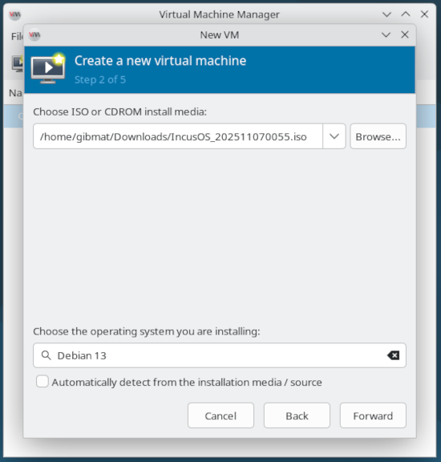

Before we can start the virtual machine, some additional configuration is required.

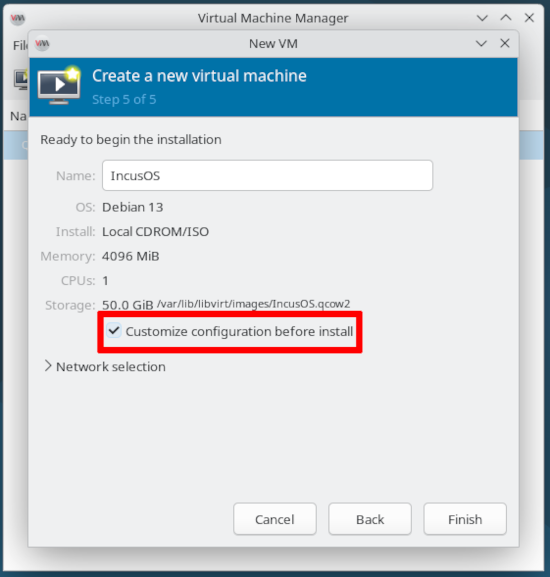

Select the `OVMF_CODE_4M.secboot.fd` UEFI firmware.

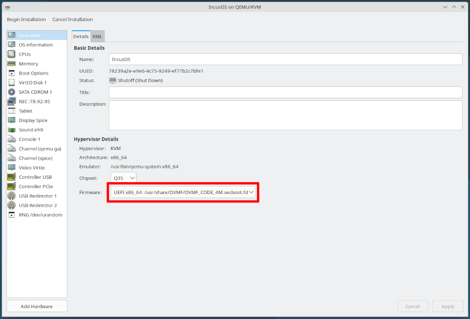

Change the main virtual disk bus to `SATA`.

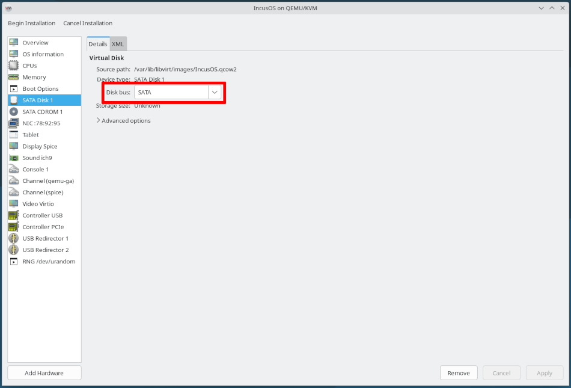

Add a TPM device.

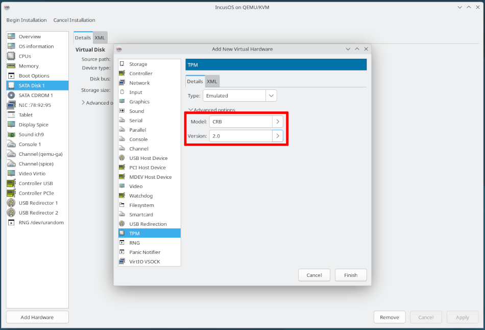

```

````

### Secure Boot and TPM configuration

IncusOS depends on Secure Boot and a TPM. When configuring the virtual machine, make the following selections:

* Select the `OVMF_CODE_4M.secboot.fd` UEFI firmware option

* Add a virtual TPM 2.0 device

### CPU, memory, network, and local storage

Configure the CPU and memory for the virtual machine as desired and add at least one network interface.

Remember that the main system drive must be at least 50GiB or larger.

## IncusOS installation

````{tabs}

```{group-tab} Command line

`virt-install` will automatically start the virtual machine, which will load the necessary Secure Boot keys from the install media and reboot. libvirt ejects the CDROM after rebooting the virtual machine, but we need to re-attach it so the install can begin.

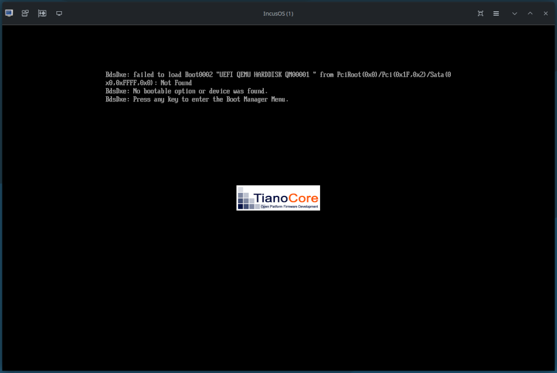

Re-attach the CDROM image and reset the virtual machine to begin the installation.

    virsh attach-disk IncusOS /home/gibmat/Downloads/IncusOS_202511070055.iso sdb --type=cdrom
    virsh reset IncusOS

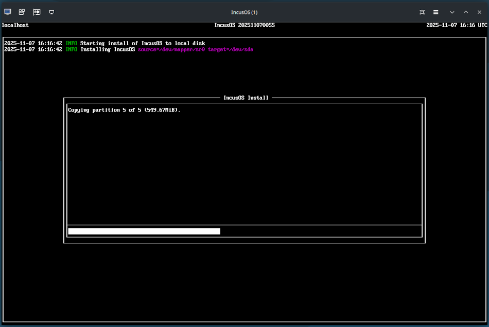

Upon completion of the install, remove the CDROM device and reset the virtual machine.

    virsh change-media IncusOS sdb --eject
    virsh reset IncusOS

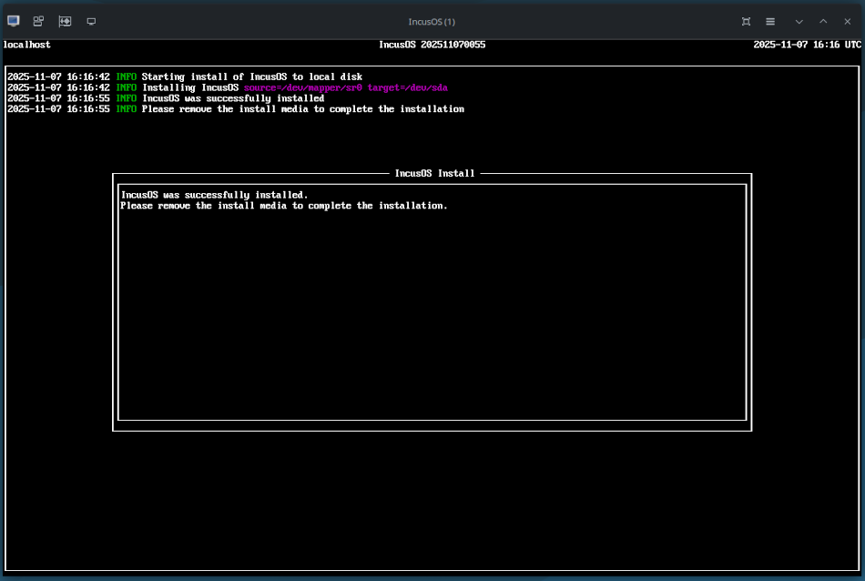

```

```{group-tab} Graphical interface

Start the virtual machine, which will load the necessary Secure Boot keys from the install media and reboot. libvirt ejects the CDROM after rebooting the virtual machine, but we need to re-attach it so the install can begin.

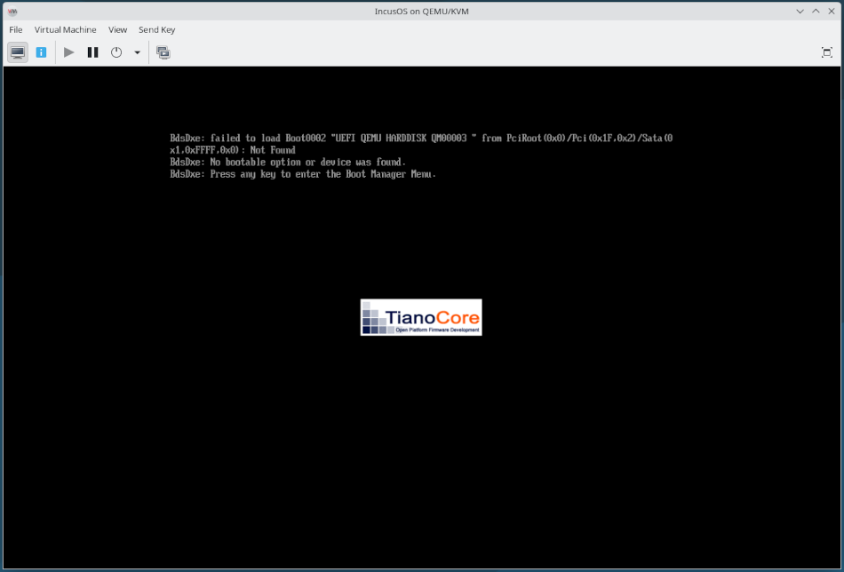

Re-attach the CDROM image, ensure the CDROM is listed among the boot devices and restart the virtual machine to begin the installation.

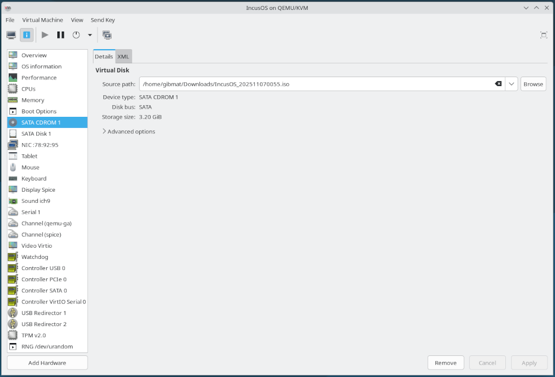

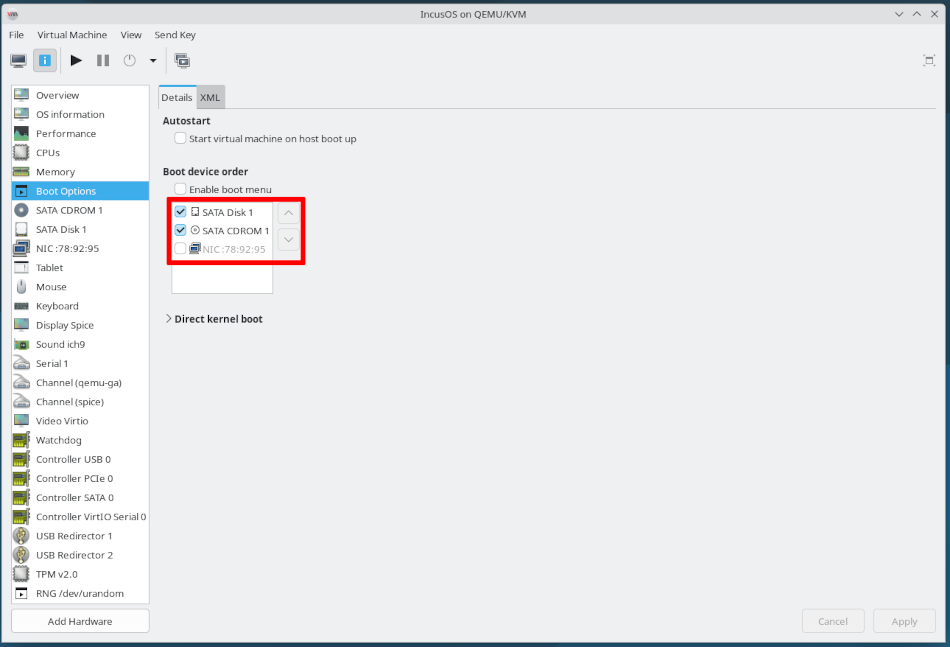

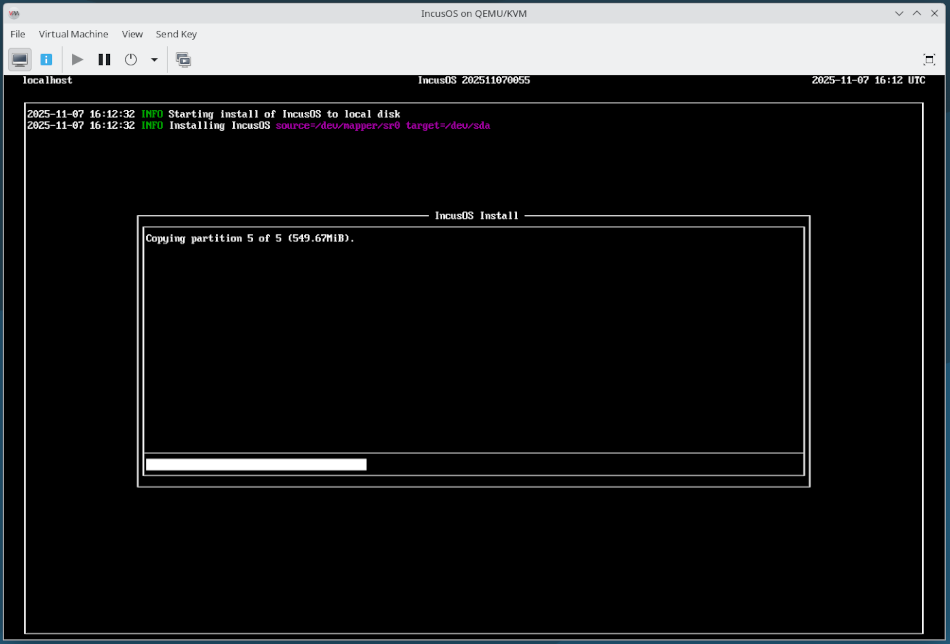

Upon completion of the install, remove the CDROM device and then stop the virtual machine.

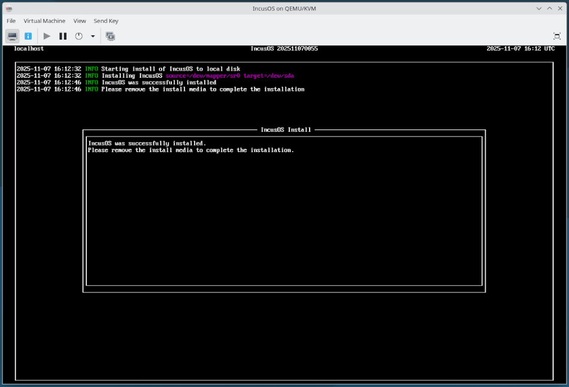

```

````

## IncusOS is ready for use

````{tabs}

```{group-tab} Command line

Once the virtual machine starts, IncusOS will perform its first boot configuration.

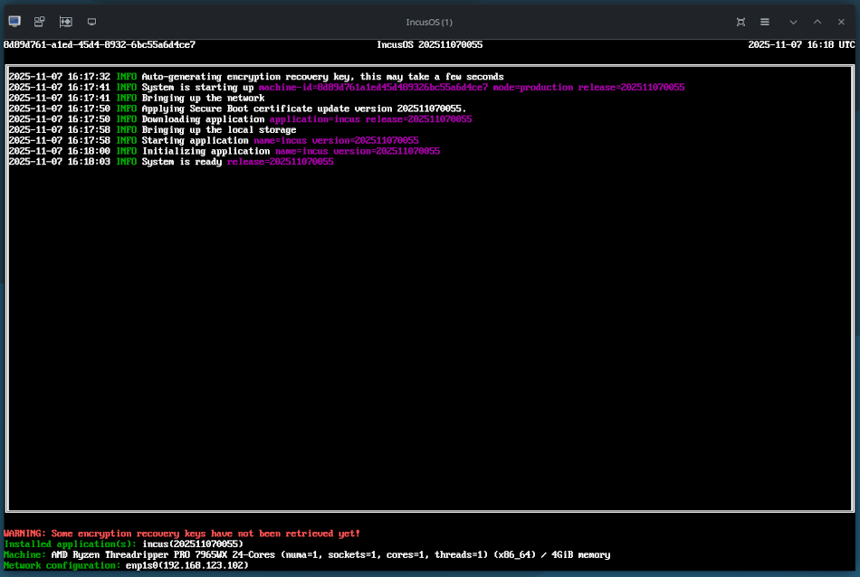

```

```{group-tab} Graphical interface

Start the virtual machine, and IncusOS will perform its first boot configuration.

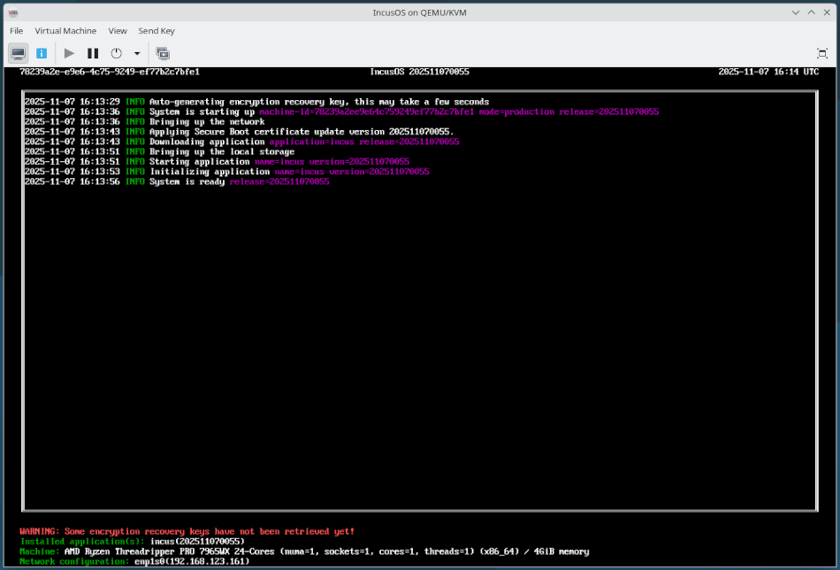

```

````

Once complete, follow the instructions for [accessing the system](../access.md).
