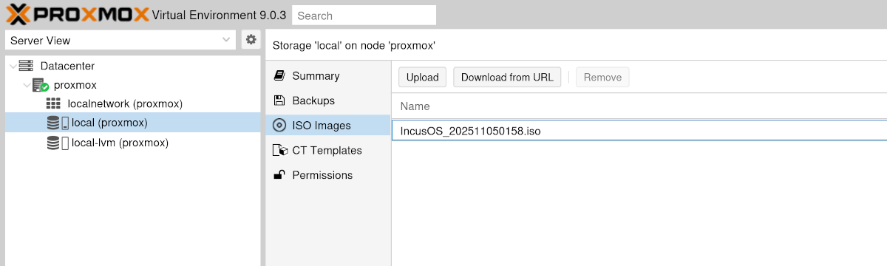
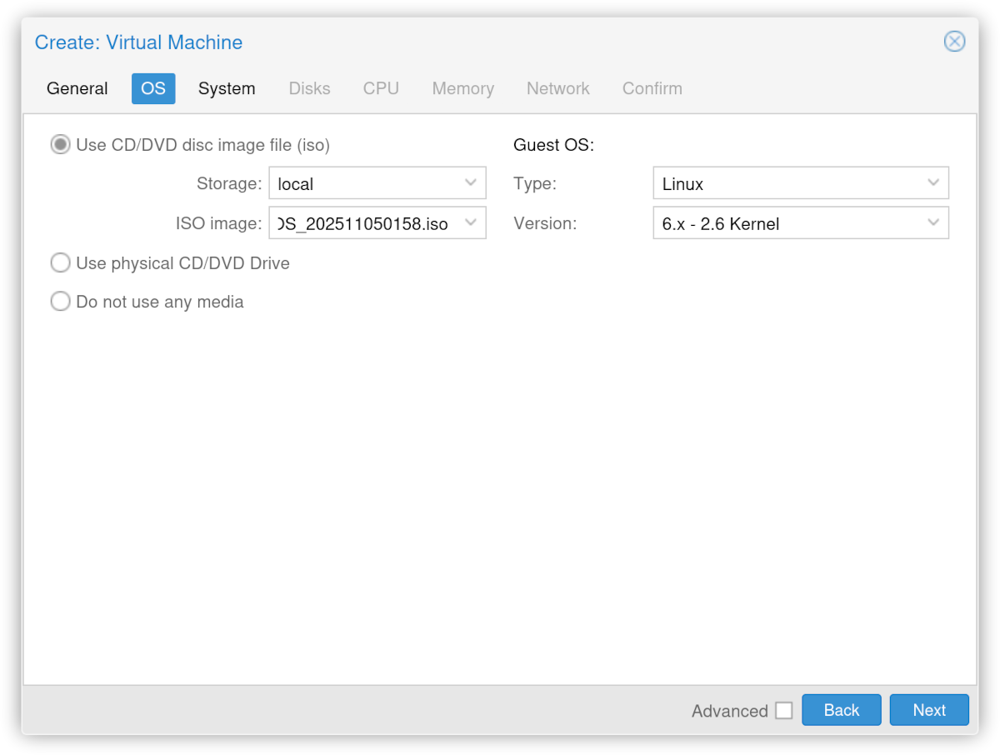
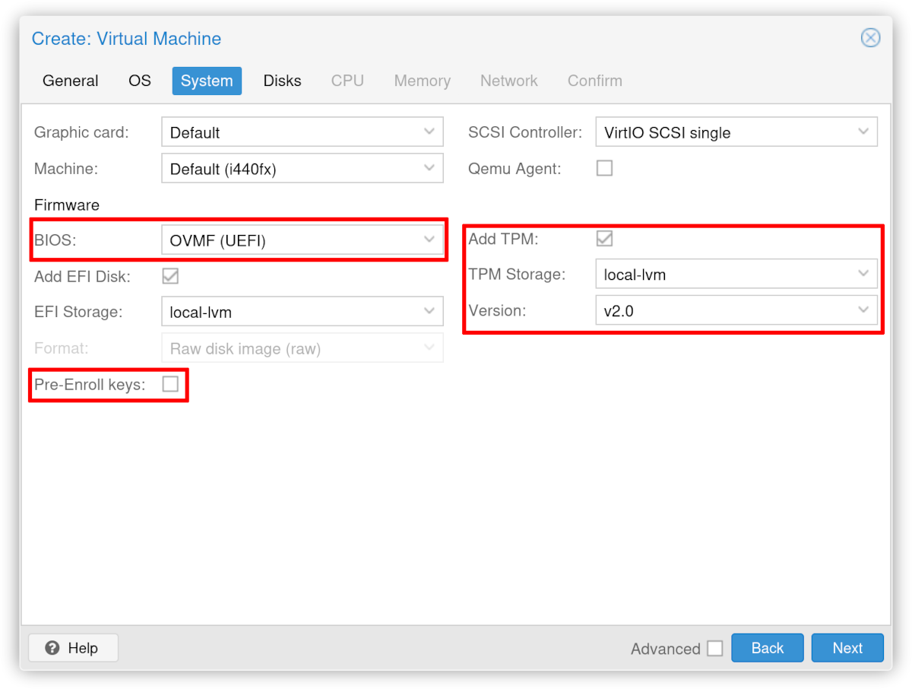
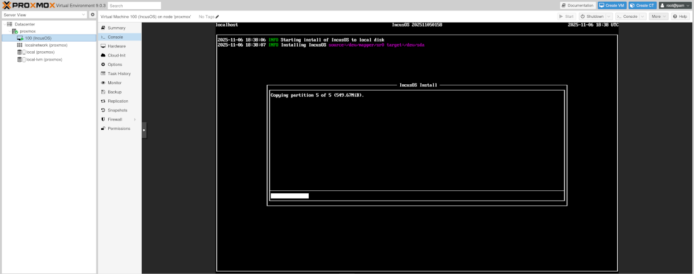
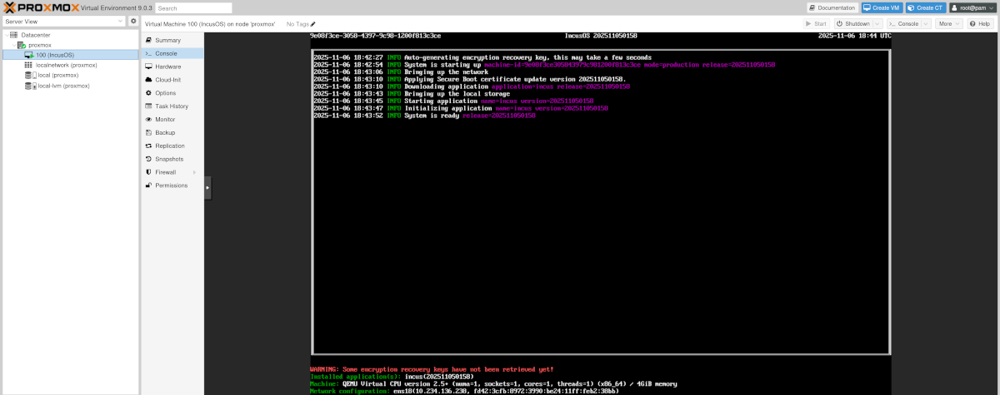

# Installing in a Proxmox virtual machine

IncusOS can be easily installed in a Proxmox virtual machine.

## Get and import install media

Follow the instructions to [get an IncusOS image](../download.md). This document will assume an ISO image is used.

Once downloaded, upload the ISO image to Proxmox's storage.

## Create a new virtual machine

Create a new virtual machine and add the ISO image.

### Secure Boot and TPM configuration

IncusOS depends on Secure Boot and a v2.0 TPM. When configuring the virtual machine, make the following selections:

* BIOS should be "OVMF (UEFI)"

* Uncheck "Pre-Enroll keys"
   * This will allow the IncusOS installer to automatically enroll the necessary Secure Boot keys

* Check "Add TPM" and set the version to be "v2.0"

### CPU, memory, network, and local storage

Configure the CPU and memory for the virtual machine as desired and add at least one network interface.

Remember that the main system drive must be at least 50GiB or larger.

## IncusOS installation

Start the virtual machine, and IncusOS will begin its installation.

Upon completion of the install, stop the virtual machine and remove the CDROM device.

## IncusOS is ready for use

Start the virtual machine, and IncusOS will perform its first boot configuration. Once complete, follow the instructions for [accessing the system](../access.md).

