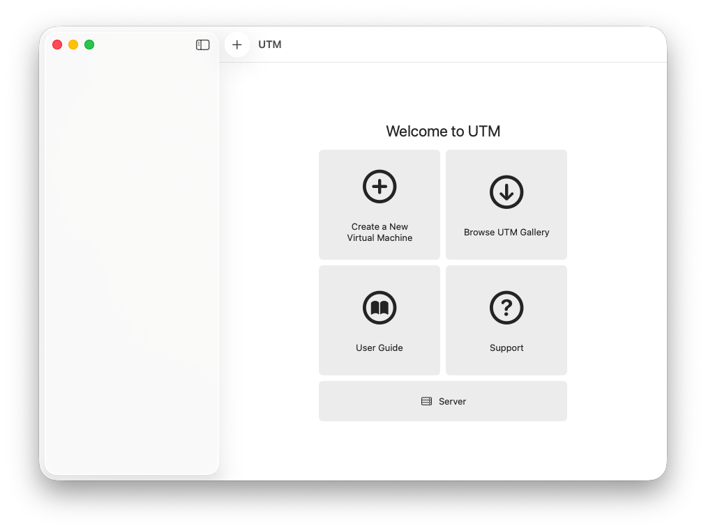
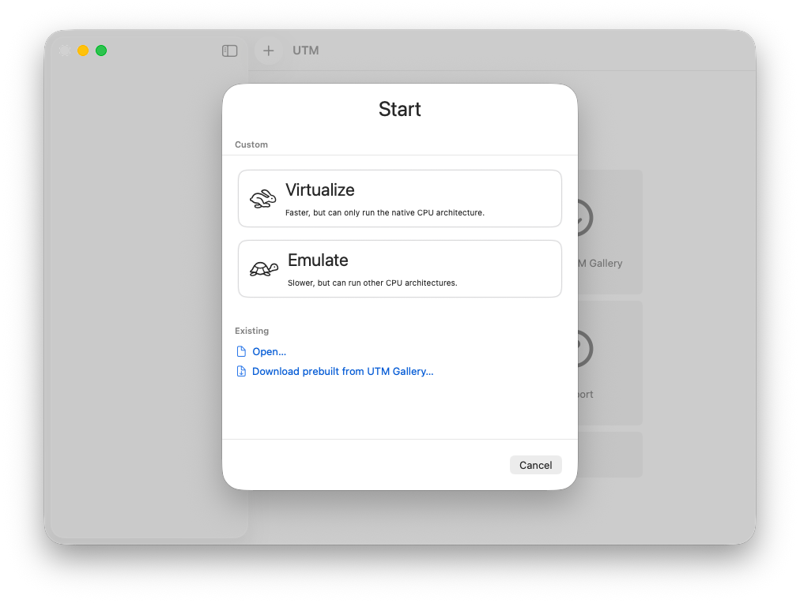
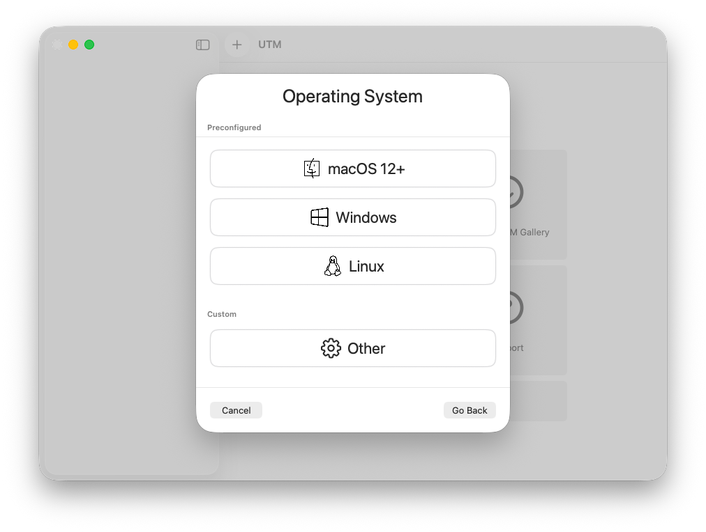
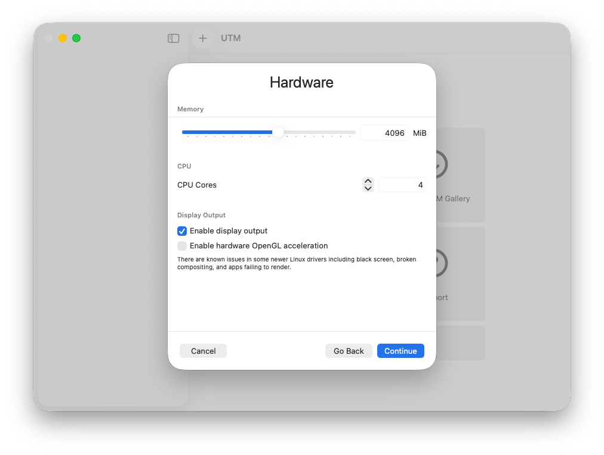
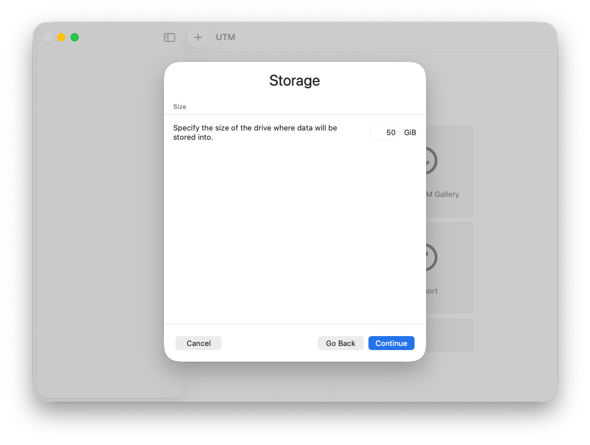
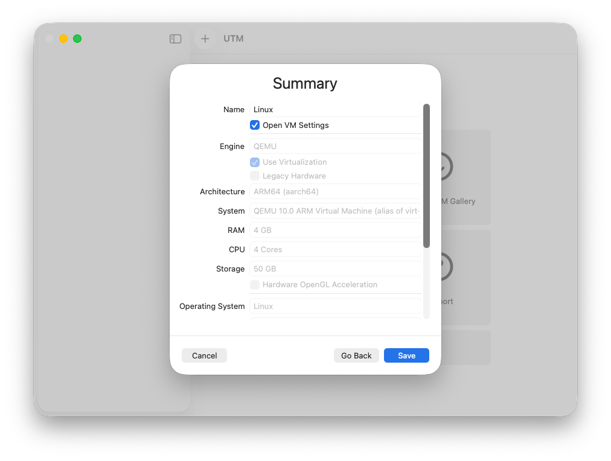
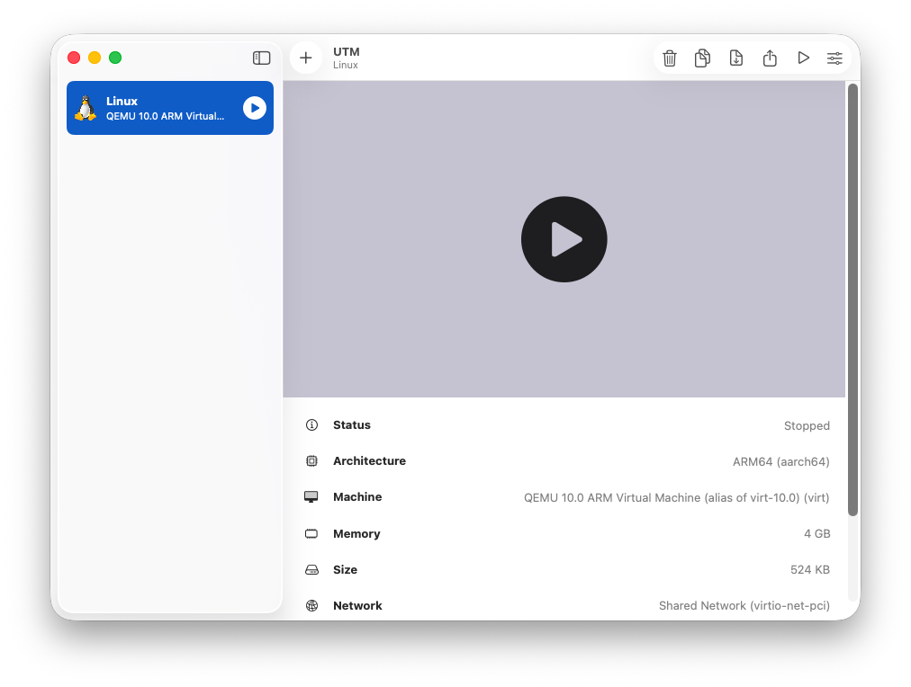
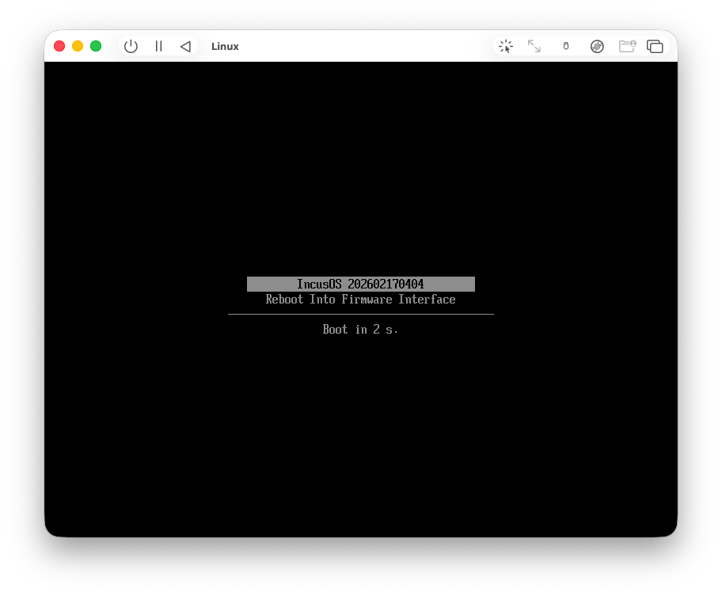
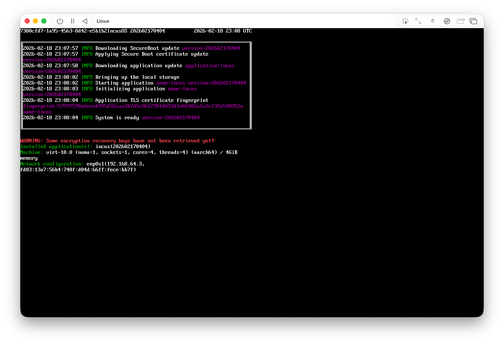

# Installing in a UTM virtual machine

IncusOS can be installed in a UTM virtual machine.

```{warning}
IncusOS requires UEFI Secure Boot and a TPM 2.0 module, both of which are only supported using the QEMU backend.
This unfortunately means that IncusOS won't be able to run Incus virtual machines as nested virtualization currently requires using the Apple Virtualization Framework which doesn't provide UEFI Secure Boot or TPM 2.0 support.
```

## Get install media

Follow the instructions to [get an IncusOS image](../download.md). Get an ISO image for `aarch64`.

## Create a new virtual machine

To run IncusOS, you'll want to create a new Linux virtual machine with at least 4GiB of RAM and 50GiB of disk space.









After creation, you'll need to go edit the virtual machine to:

- Enable a TPM 2.0 device
- Disable loading of the default Secure Boot keys



## IncusOS installation

Starting the virtual machine will proceed with the Secure Boot configuration and then go through installation.



Upon completion of the install, stop the virtual machine, edit it and remove the CDROM.

## IncusOS is ready for use

Start the virtual machine, and IncusOS will perform its first boot configuration. Once complete, follow the instructions for [accessing the system](../access.md).


