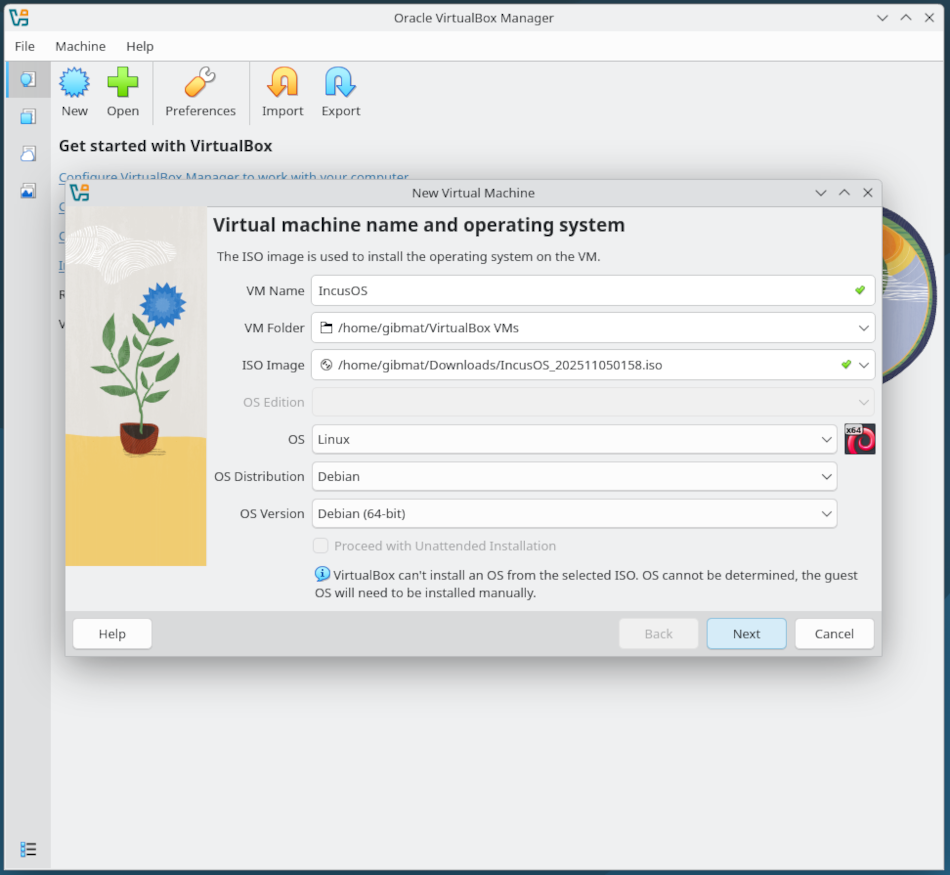
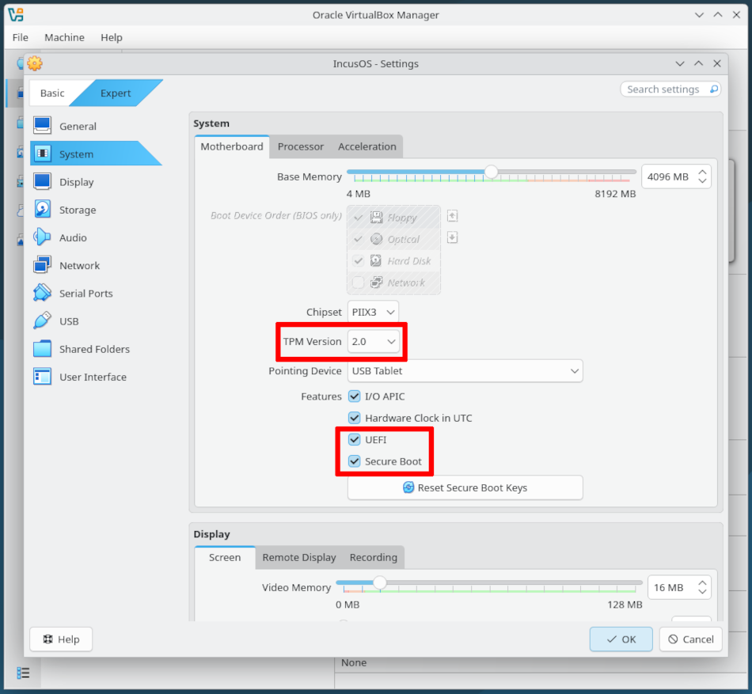
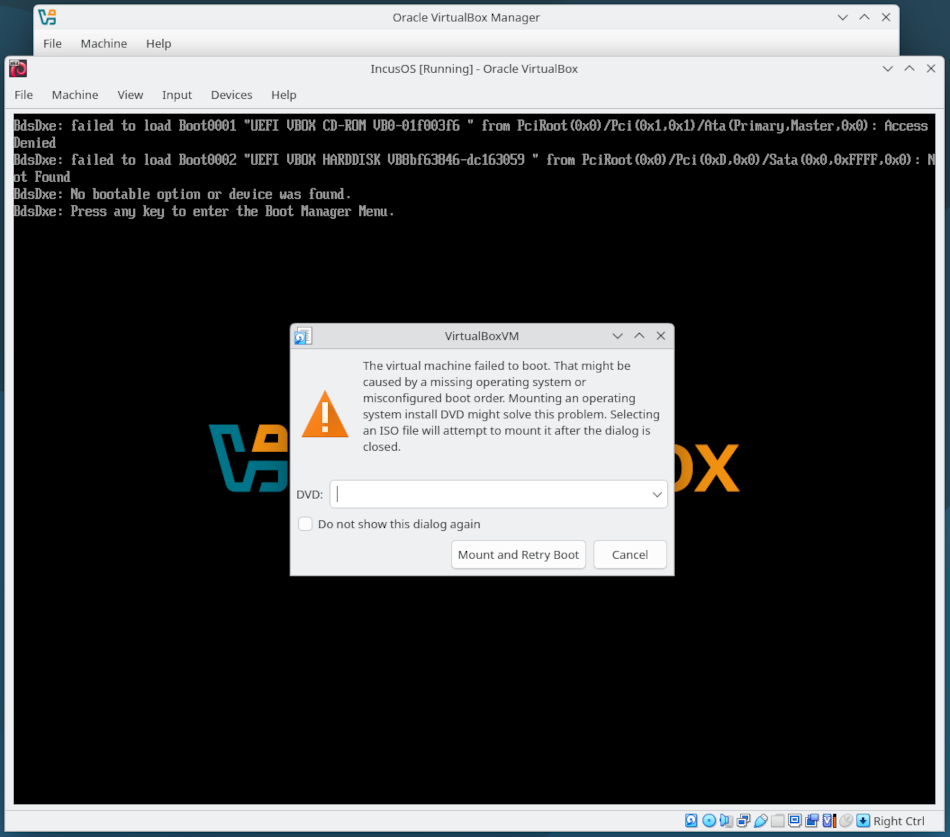
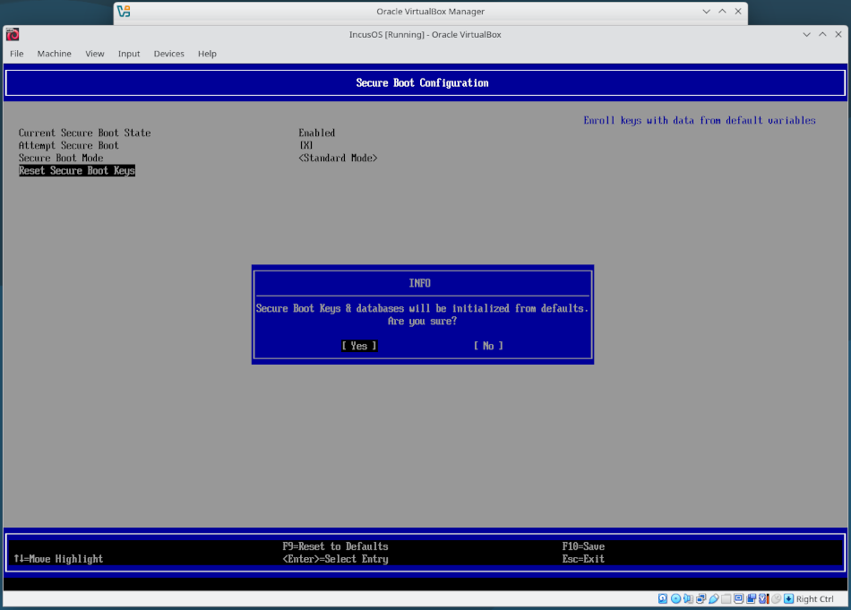
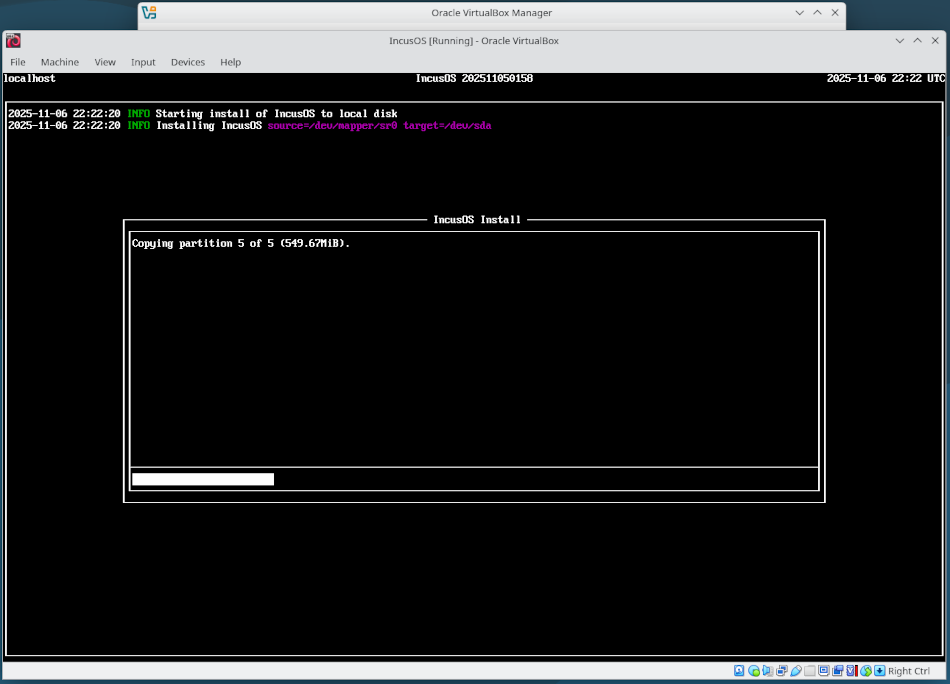
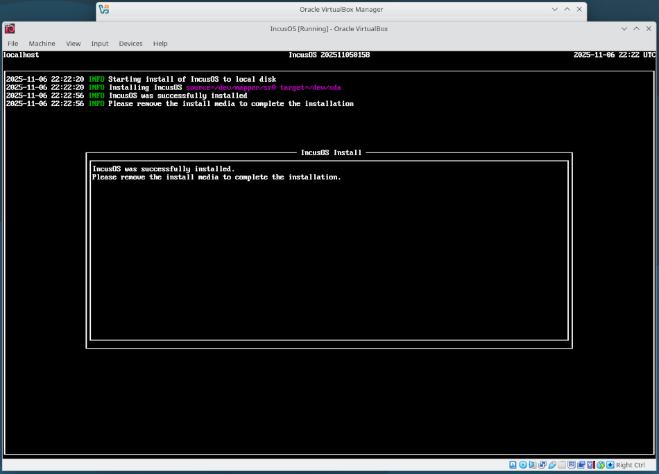
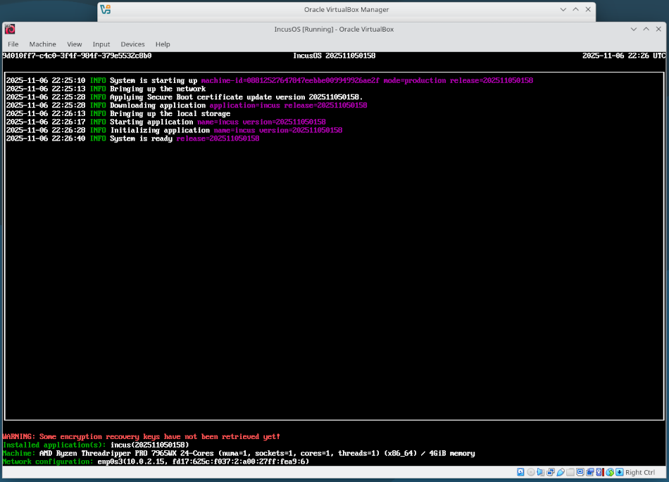

# Installing in a VirtualBox virtual machine

IncusOS can be installed in a VirtualBox virtual machine. A bit of hand-holding is required to properly clear the default Secure Boot keys, but afterwards the installation proceeds normally.

## Get install media

Follow the instructions to [get an IncusOS image](../download.md). This document will assume an ISO image is used.

## Create a new virtual machine

Create a new virtual machine. Set the OS Distribution to "Debian".

### Secure Boot and TPM configuration

IncusOS depends on Secure Boot and a v2.0 TPM. When configuring the virtual machine, make the following selections under the "System" section (must be in "Expert" mode):

* Set the TPM version to 2.0

* Under Features, check both "UEFI" and "Secure Boot"

### CPU, memory, network, and local storage

Configure the CPU and memory for the virtual machine as desired and add at least one network interface.

Remember that the main system drive must be at least 50GiB or larger.

## IncusOS installation

### Clearing default Secure Boot keys

On first boot, VirtualBox will display an error about the virtual machine failing to boot. Click "Cancel" to dismiss the message, then ensure focus is on the virtual machine's window and press any key to enter the boot manager.

Once in the boot manager, navigate to `Device Manager > Secure Boot Configuration` and select `Reset Secure Boot Keys`. Confirm the reset, press `F10` to save the changes, then reboot the virtual machine.

### Performing the install

After rebooting the virtual machine after clearing the Secure Boot keys, IncusOS will begin its installation.

Upon completion of the install, stop the virtual machine and remove the CDROM device.

## IncusOS is ready for use

Start the virtual machine, and IncusOS will perform its first boot configuration. Once complete, follow the instructions for [accessing the system](../access.md).

