# Installing in a VMware virtual machine

IncusOS can be easily installed in a VMware virtual machine when running with vSphere.

```{note}
IncusOS requires the use of a virtual TPM device, this appears to require the use of vSphere and won't work on standalone ESXi.
```

## Configure a key provider

To be able to use virtual TPM devices with VMware, you need to have a suitable key provider defined in vSphere.

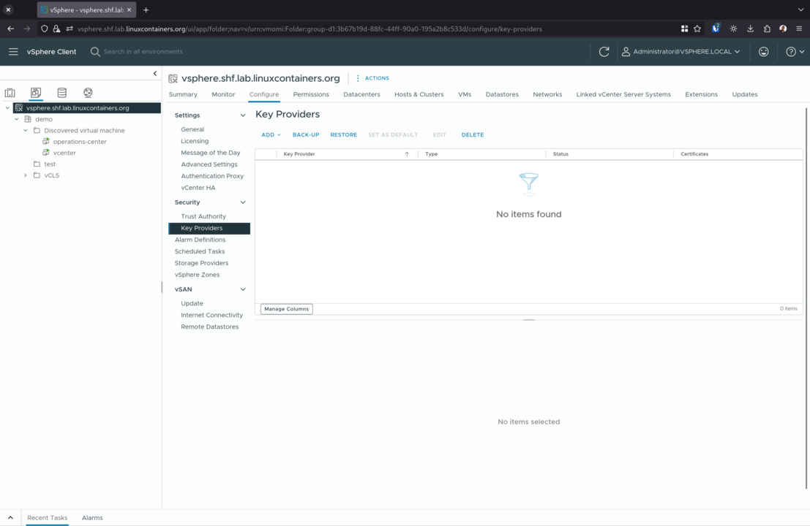

If you don't have one already, create a new native key provider.

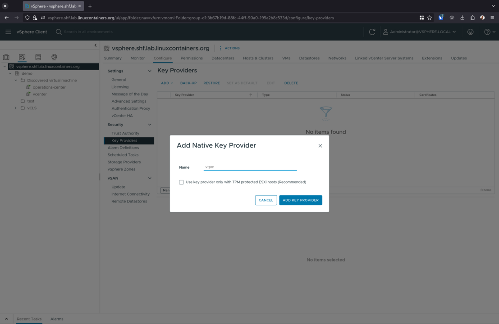

And then back it up to complete its initialization.

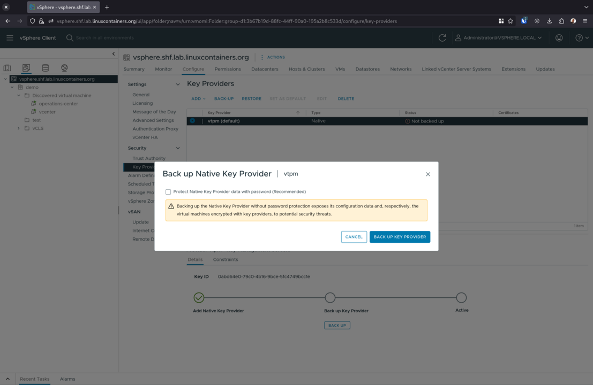

You'll then have a functional key provider and will be able to attach TPM devices to virtual machines.

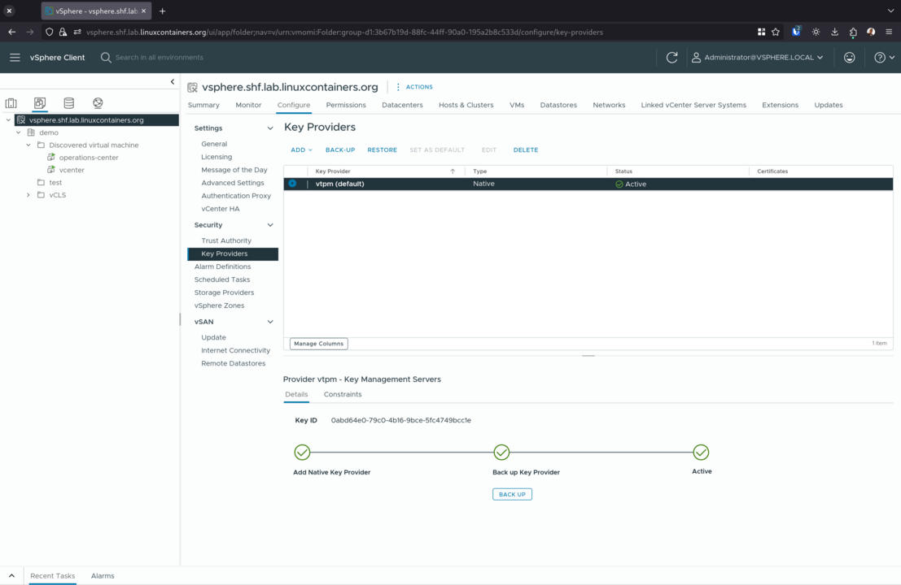

## Configure networking

Because IncusOS needs runs nested container and virtual machines, the
VMware network security policy must be pretty relaxed to allow for the
virtual machine to run its internal bridge.

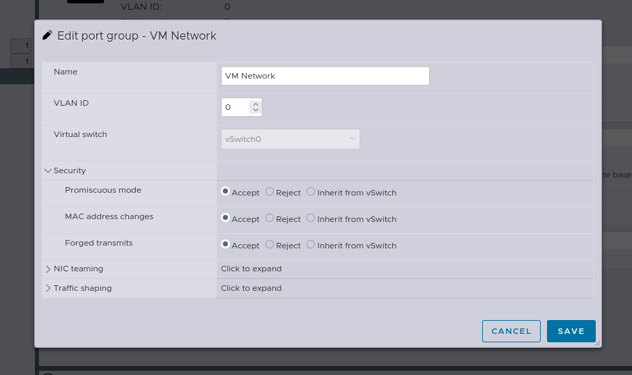

## Get and import install media

Follow the instructions to [get an IncusOS image](../download.md). This document will assume an ISO image is used.

Once downloaded, upload the ISO image to a VMware datastore.


## Create a new virtual machine

Pick a name and location.

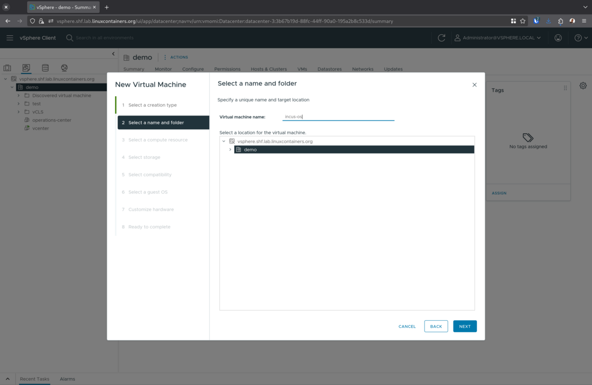

Pick a server to run the virtual machine on.

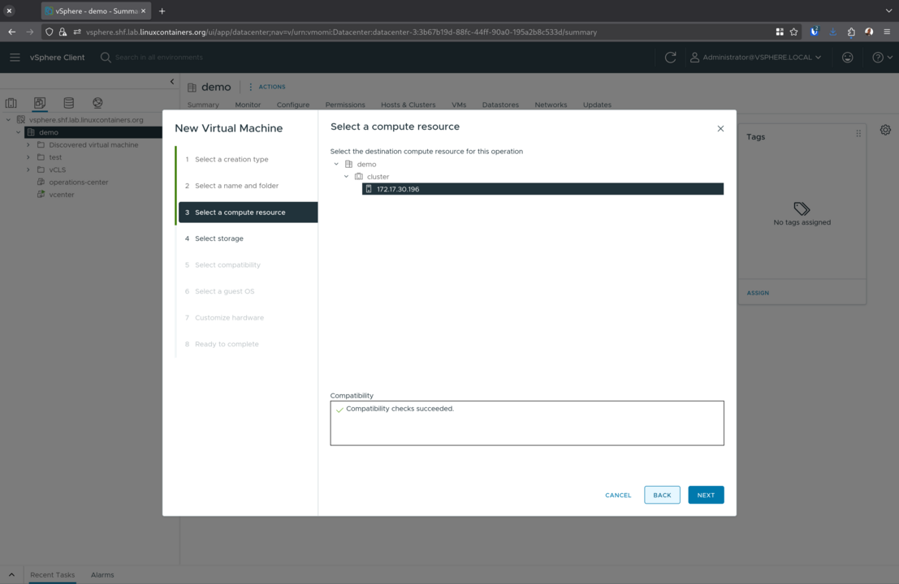

Select a datastore for the root disk.

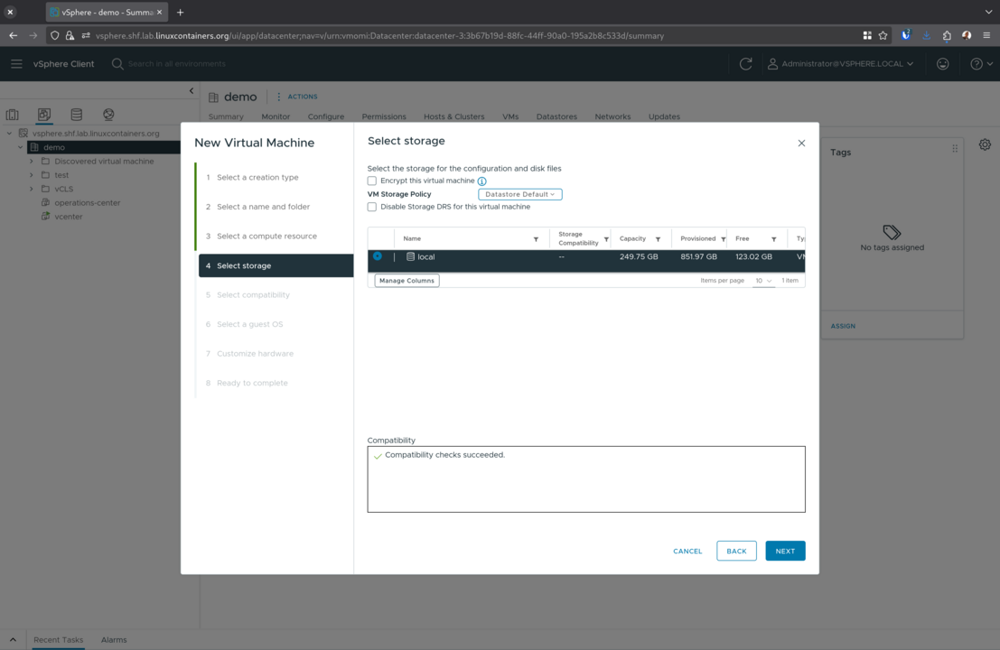

Select the compatibility level (default is fine).

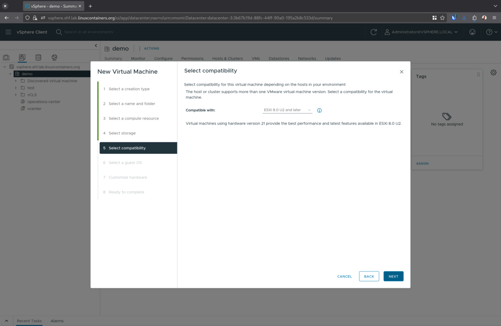

Select `Linux` and `Other 6.x or later Linux (64-bit)` as the operating system.

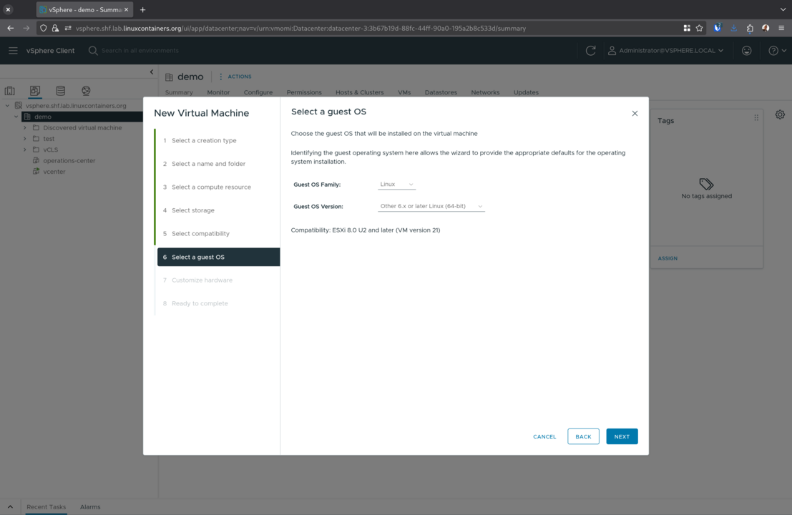

Customize the virtual machine hardware, recommended changes are:

- Set at least 4 CPUs and 4GiB of RAM
- Add a NVMe controller
- Set the root disk size to 50GiB and attach it to the NVMe controller
- Detach the SCSI controller (now unused)
- Attach a TPM module
- Attach the previously uploaded ISO image to the CDROM device and make sure to have it connect on start-up

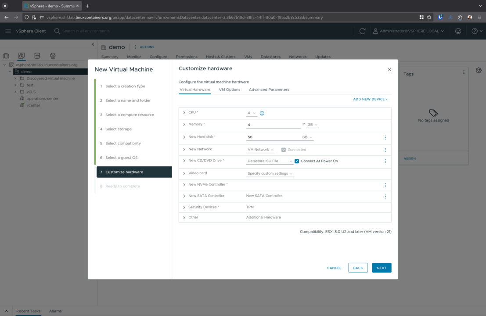

In the options tab, under `Boot Options`, make sure that `Secure Boot` is enabled.

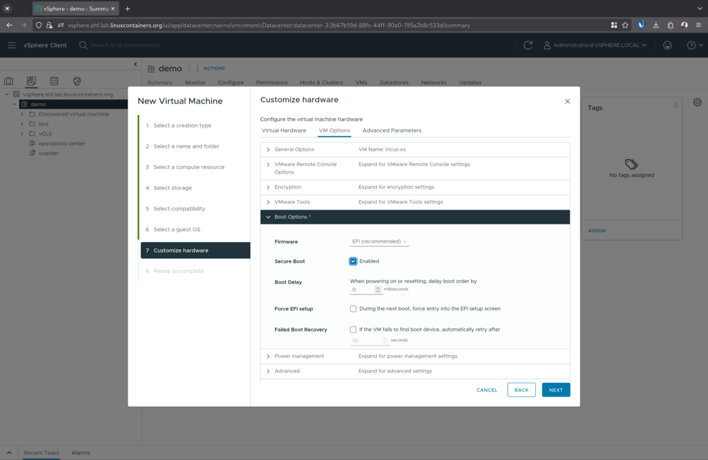

In the `Advanced Parameters` tab, add the following entries:

- `uefi.secureBoot.kekDefault.file0` set to `secureboot-KEK-R1.der`
- `uefi.secureBoot.dbDefault.file0` set to `secureboot-2025-R1.der`
- `uefi.secureBoot.dbDefault.file1` set to `secureboot-2026-R1.der`

Then complete the virtual machine creation.

```{note}
Do not start the virtual machine at this point or it will create a bad Secure Boot state.
```

## Upload the Secure Boot keys
Open the datastore view and go to the virtual machine's folder.

Then go to [`https://images.linuxcontainers.org/os/keys/`](https://images.linuxcontainers.org/os/keys/) and download:

- `secureboot-KEK-R1.der`
- `secureboot-2025-R1.der`
- `secureboot-2026-R1.der`

Once downloaded, upload those three files to the virtual machine's folder.

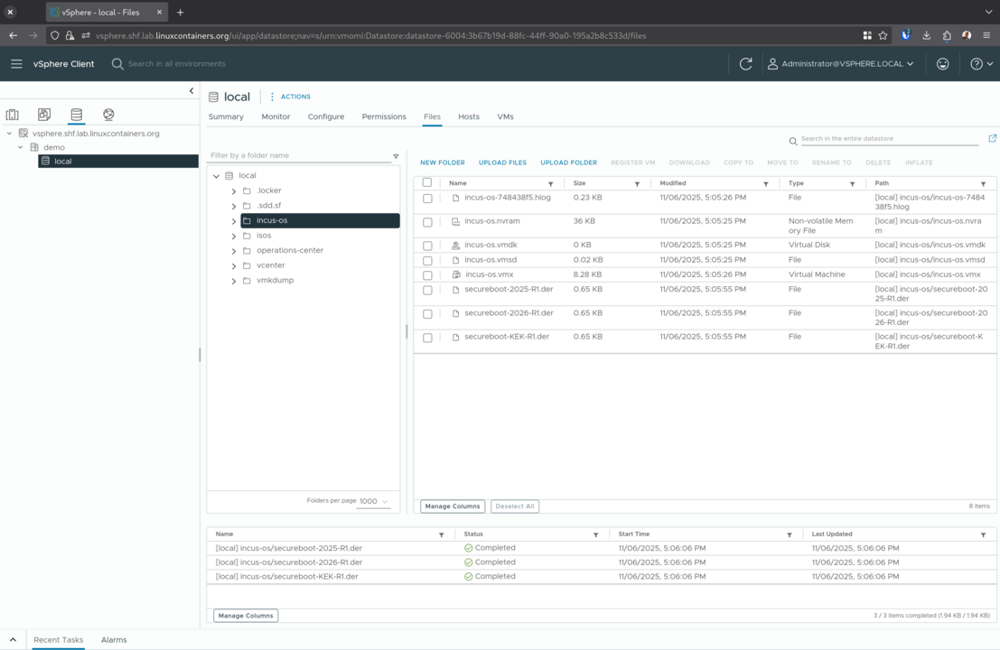

## IncusOS installation

Start the virtual machine, and IncusOS will begin its installation.

```{note}
VMware takes a very long time to hash the kernel image during boot.
This leads to a black screen lasting around 3 minutes following the boot loader message.
```

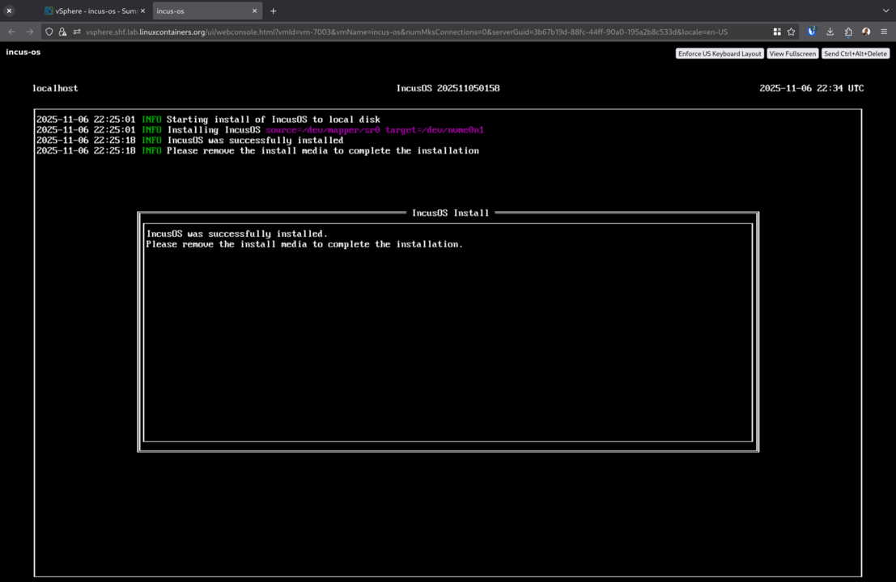

Once installed, stop the virtual machine and edit its settings to disconnect the CDROM device.

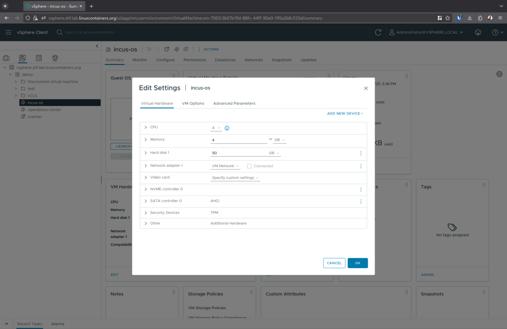

## IncusOS is ready for use

Start the virtual machine, and IncusOS will perform its first boot configuration. Once complete, follow the instructions for [accessing the system](../access.md).

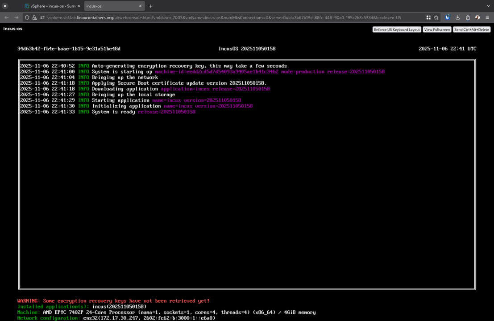
